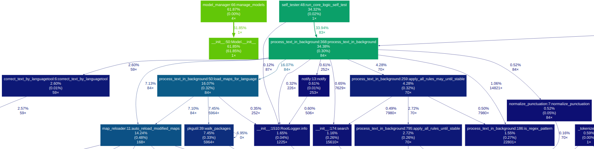
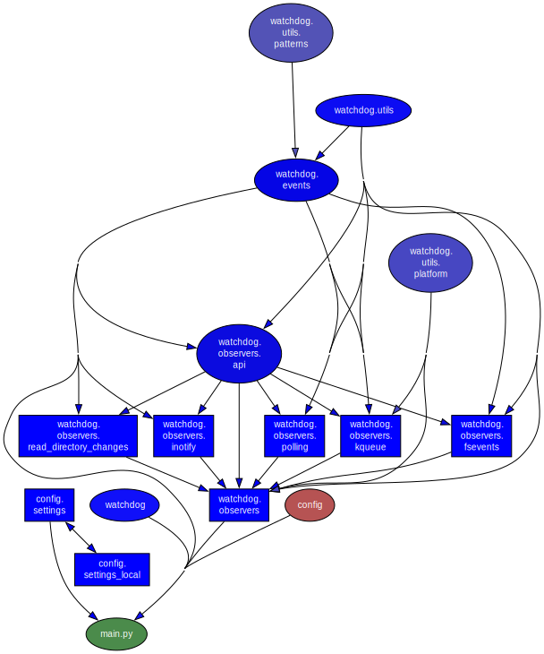

# صوت غير متصل على مستوى النظام للأوامر أو الرسائل النصية، نظام قابل للتوصيل

                                                     ## بداية سريعة
           1. قم بتنزيل هذا المستودع أو استنساخه
2. قم بتشغيل البرنامج النصي للإعداد لنظام التشغيل لديك (راجع مجلد "الإعداد/"):
                   - Linux (Arch/Manjaro): `bash setup/manjaro_arch_setup.sh`
                                                 ===> 🧩 اقرأ [docs/LINUX_WAYLAND_dotool](../docs/LINUX_WAYLAND_dotool-arlang.md)
                        - Linux (Ubuntu/Debian): `bash setup/ubuntu_setup.sh`
                               - Linux (openSUSE): `bash setup/suse_setup.sh`
                 - نظام التشغيل macOS: `bash setup/macos_setup.sh`
                   - ويندوز: `setup/windows11_setup_with_ahk_copyq.bat`
                 3. ابدأ Aura: `./scripts/restart_venv_and_run-server.sh`
4. اضغط على مفتاح التشغيل السريع وتحدث — **[full guide →](../docs/GettingStarted-arlang.md)**


                      **⚠️ متطلبات النظام والتوافق**

* **Windows:** ✅ مدعوم بالكامل (يستخدم AutoHotkey/PowerShell).
       * **macOS:** ✅ مدعوم بالكامل (يستخدم AppleScript).
                       * **Linux (X11/Xorg):** ✅ مدعوم بالكامل.
* **Linux (Wayland):** ✅ مدعوم بالكامل (تم اختباره على KDE Plasma 6 / Wayland).
* **Linux (إصدار متجدد قائم على CachyOS / Arch):** ✅ مدعوم بالكامل.
يتطلب mimalloc (`sudo pacman -S mimalloc`) بسبب توافق glibc 2.43.
                                              اكس سبيس بريك اكس
SL5 Aura عبارة عن مساعد صوتي متكامل **غير متصل بالإنترنت** مبني على **Vosk** (لتحويل الكلام إلى نص) و**LanguageTool** (للقواعد النحوية/الأسلوب)، ويتميز بوظيفة احتياطية **Local LLM (Ollama) اختيارية** للاستجابات الإبداعية والمطابقة الغامضة المتقدمة. إنه يحول صوتك إلى إجراءات ونص دقيق، مصمم للتخصيص النهائي من خلال نظام قواعد قابل للتوصيل ومحرك برمجة نصية ديناميكي.
                                              اكس سبيس بريك اكس
الترجمات: هذا المستند موجود أيضًا في [other languages](https://github.com/sl5net/SL5-aura-service/tree/master/README.i18n).


ملاحظة: العديد من النصوص عبارة عن ترجمات تم إنشاؤها آليًا للوثائق الإنجليزية الأصلية وهي مخصصة للإرشاد العام فقط. وفي حالة وجود تناقضات أو غموض، فإن النسخة الإنجليزية هي التي تسود دائمًا. نحن نرحب بالمساعدة من المجتمع لتحسين هذه الترجمة!

                            ### 📺 العرض التجريبي للمحطة

[](https://github.com/sl5net/SL5-aura-service/blob/master/data/demo_fast.gif)

> **نصيحة:** للحصول على تجربة طرفية أفضل، راجع [Zsh Integration](../docs/linux/zsh-integration-arlang.md).

                                             ### 🎥 فيديو تعليمي
                      [](https://www.youtube.com/watch?v=BZCHonTqwUw)

                                     *(الرابط البديل: [skipvids.com](https://skipvids.com/?v=BZCHonTqwUw))*


                                           ## الميزات الرئيسية

* **خاص وغير متصل بالإنترنت:** محلي 100%. لا توجد بيانات تترك جهازك على الإطلاق.
* **محرك البرمجة الديناميكية:** تجاوز مجرد استبدال النص. يمكن للقواعد تنفيذ برامج Python النصية المخصصة (`on_match_exec`) لتنفيذ إجراءات متقدمة مثل استدعاء واجهات برمجة التطبيقات (على سبيل المثال، البحث في Wikipedia)، أو التفاعل مع الملفات (على سبيل المثال، إدارة قائمة المهام)، أو إنشاء محتوى ديناميكي (على سبيل المثال، تحية بريد إلكتروني تراعي السياق).
* **قواعد مدركة للسياق:** تقييد القواعد على تطبيقات محددة. باستخدام `only_in_windows`، يمكنك التأكد من تشغيل القاعدة فقط إذا كان عنوان نافذة معين (على سبيل المثال، "Terminal" أو "VS Code" أو "Browser") نشطًا. يعمل هذا عبر الأنظمة الأساسية (Linux وWindows وmacOS).
* **محرك التحويل عالي التحكم:** ينفذ خط أنابيب معالجة يعتمد على التكوين وقابل للتخصيص بدرجة كبيرة. يتم تحديد أولوية القاعدة، واكتشاف الأوامر، وتحويلات النص بشكل كامل من خلال الترتيب التسلسلي للقواعد في الخرائط الغامضة، مما يتطلب **التكوين، وليس الترميز**.
* **الاستخدام المحافظ لذاكرة الوصول العشوائي:** يدير الذاكرة بذكاء، ولا يتم تحميل النماذج مسبقًا إلا في حالة توفر ذاكرة وصول عشوائي كافية، مما يضمن الأولوية دائمًا للتطبيقات الأخرى (مثل ألعاب الكمبيوتر).
* **النظام الأساسي المشترك:** يعمل على Linux وmacOS وWindows.
* ** مؤتمت بالكامل: ** يدير خادم LanguageTool الخاص به (ولكن يمكنك استخدام خادم خارجي أيضًا).
* **سرعة فائقة:** يضمن التخزين المؤقت الذكي إشعارات "الاستماع..." الفورية والمعالجة السريعة.

                                                            ## التوثيق

للحصول على مرجع فني كامل، بما في ذلك جميع الوحدات والبرامج النصية، يرجى زيارة صفحة الوثائق الرسمية لدينا. يتم إنشاؤه تلقائيًا ويتم تحديثه دائمًا.

                                                                    [**Go to Documentation >>**](https://sl5net.github.io/SL5-aura-service/)


                                                    ### حالة البناء
                                     [](https://youtu.be/D9ylPBnP2aQ)
[](https://github.com/sl5net/SL5-aura-service/actions/workflows/ubuntu_setup.yml)
[](https://github.com/sl5net/SL5-aura-service/actions/workflows/suse_setup.yml)
[](https://github.com/sl5net/SL5-aura-service/actions/workflows/macos_setup.yml)
[](https://github.com/sl5net/SL5-aura-service/actions/workflows/windows11_setup_bat.yml)

                      [](https://sl5net.github.io/SL5-aura-service/)

                                     **اقرأ هذا بلغات أخرى:**

[🇬🇧 English](../README.md) | [🇸🇦 العربية](../README.i18n/README-arlang.md) | [🇩🇪 Deutsch](../README.i18n/README-delang-arlang.md) | [🇪🇸 Español](../README.i18n/README-eslang-arlang.md) | [🇫🇷 Français](../README.i18n/README-frlang-arlang.md) | [🇮🇳 हिन्दी](../README.i18n/README-hilang-arlang.md) | [🇯🇵 日本語](../README.i18n/README-jalang-arlang.md) | [🇰🇷 한국어](../README.i18n/README-kolang-arlang.md) | [🇵🇱 Polski](../README.i18n/README-pllang-arlang.md) | [🇵🇹 Português](../README.i18n/README-ptlang-arlang.md) | [🇧🇷 Português Brasil](../README.i18n/README-pt-BRlang-arlang.md) | [🇨🇳 简体中文](../README.i18n/README-zh-CNlang-arlang.md)

                                                                          ---


                                                                ## تثبيت

### 🎥 التثبيت السريع دون اعتدال (Manjaro/Arch Video)
شاهد عملية الإعداد الكاملة التي تستغرق 6 دقائق:
                                          * **التحميل:** ~3 دقائق
* **الإعداد والبدء الأول:** ~3 دقائق (بما في ذلك معالج الترحيب)

                                                          👉 **[SL5 Aura Installation Live-Demo on YouTube](https://www.youtube.com/watch?v=29xiwIW1ZHQ)**


                            الإعداد هو عملية من خطوتين:
1. قم بتنزيل الإصدار الأخير أو الإصدار الرئيسي ( https://github.com/sl5net/SL5-aura-service/archive/master.zip ) أو انسخ هذا المستودع على جهاز الكمبيوتر الخاص بك.
2. قم بتشغيل البرنامج النصي للإعداد لمرة واحدة لنظام التشغيل الخاص بك.

تتعامل نصوص الإعداد مع كل شيء: تبعيات النظام، وبيئة Python، وتنزيل النماذج والأدوات الضرورية (حوالي 4 جيجابايت) مباشرةً من إصدارات GitHub الخاصة بنا لتحقيق أقصى سرعة.


#### لنظام التشغيل Linux وmacOS وWindows (مع استثناء اللغة الاختياري)

لتوفير مساحة القرص وعرض النطاق الترددي، يمكنك استبعاد نماذج لغة محددة (`de`، `en`) أو كافة النماذج الاختيارية (`all`) أثناء الإعداد. **يتم تضمين المكونات الأساسية (LanguageTool, Lid.176) دائمًا.**

افتح محطة طرفية في الدليل الجذر للمشروع وقم بتشغيل البرنامج النصي لنظامك:

```bash
# For Ubuntu/Debian, Manjaro/Arch, macOS, or other derivatives
# (Note: Use bash or sh to execute the setup script)

bash setup/{your-os}_setup.sh [OPTION]

# For Arch-based systems (Manjaro, CachyOS, EndeavourOS, etc.):
`bash setup/manjaro_arch_setup.sh`

`sudo pacman -S mimalloc`


# Examples:
# Install everything (Default):
# bash setup/manjaro_arch_setup.sh

# Exclude German models:
# bash setup/manjaro_arch_setup.sh exclude=de

# Exclude all VOSK language models:
# bash setup/manjaro_arch_setup.sh exclude=all

# For Windows in an Admin-Powershell session

setup/windows11_setup.ps1 -Exclude [OPTION]

# Examples:
# Install everything (Default):
# setup/windows11_setup.ps1

# Exclude English models:
# setup/windows11_setup.ps1 -Exclude "en"

# Exclude German and English models:
# setup/windows11_setup.ps1 -Exclude "de,en"

# Or (recommend) - Start des BAT: 
windows11_setup.bat -Exclude "en"
```

                                       #### لنظام التشغيل Windows
قم بتشغيل البرنامج النصي للإعداد بامتيازات المسؤول.

** قم بتثبيت أداة للقراءة والتشغيل على سبيل المثال. [CopyQ](https://github.com/hluk/CopyQ) أو [AutoHotkey v2](https://www.autohotkey.com/)**. وهذا مطلوب لمراقب كتابة النص.

يتم التثبيت تلقائيًا بالكامل ويستغرق حوالي **8-10 دقائق** عند استخدام نموذجين على نظام جديد.

                              1. انتقل إلى مجلد "الإعداد".
2. انقر نقرًا مزدوجًا فوق **`windows11_setup_with_ahk_copyq.bat`**.
* *سيطالب البرنامج النصي تلقائيًا بامتيازات المسؤول.*
* *يقوم بتثبيت النظام الأساسي، ونماذج اللغة، و**AutoHotkey v2**، و**CopyQ**.*
3. بمجرد اكتمال التثبيت، سيتم تشغيل **Aura Dictation** تلقائيًا.

> **ملاحظة:** لا تحتاج إلى تثبيت Python أو Git مسبقًا؛ البرنامج النصي يتعامل مع كل شيء.

                                                                          ---

                            #### التثبيت المتقدم / المخصص
إذا كنت تفضل عدم تثبيت أدوات العميل (AHK/CopyQ) أو تريد توفير مساحة القرص عن طريق استبعاد لغات معينة، فيمكنك تشغيل البرنامج النصي الأساسي عبر سطر الأوامر:

```powershell
# Core Setup only (No AHK, No CopyQ)
setup/windows11_setup_with_ahk_copyq.bat

# Exclude specific language models (saves space):
# Exclude English:
setup/windows11_setup_with_ahk_copyq.bat -Exclude "en"

# Exclude German and English:
setup/windows11_setup_with_ahk_copyq.bat -Exclude "de,en"
```


                                                                          ---

                                                        ## الاستخدام

                                               ### 1. ابدأ الخدمات

                                                    #### على Linux وmacOS
نص واحد يعالج كل شيء. يبدأ خدمة الإملاء الرئيسية ومراقب الملفات تلقائيًا في الخلفية.
```bash
# Run this from the project's root directory
./scripts/restart_venv_and_run-server.sh
```

                                  #### على نظام التشغيل Windows
يتم بدء الخدمة عبر **عملية يدوية مكونة من خطوتين**:

1. ** ابدأ الخدمة الرئيسية: ** قم بتشغيل `start_aura.bat`. أو ابدأ من .venv الخدمة باستخدام python3

### 2. قم بتكوين مفتاح التشغيل السريع الخاص بك

لتشغيل الإملاء، تحتاج إلى مفتاح تشغيل سريع عالمي يقوم بإنشاء ملف محدد. نوصي بشدة باستخدام الأداة المشتركة بين الأنظمة الأساسية [CopyQ](https://github.com/hluk/CopyQ).

                                                   #### توصيتنا: CopyQ

قم بإنشاء أمر جديد في CopyQ باستخدام اختصار عام.

                    **الأوامر لنظام التشغيل Linux/macOS:**
```bash
touch /tmp/sl5_record.trigger
```

**أمر لنظام التشغيل Windows عند استخدام [CopyQ](https://github.com/hluk/CopyQ):**
```js
copyq:
var filePath = 'c:/tmp/sl5_record.trigger';

var f = File(filePath);

if (f.openAppend()) {
    f.close();
} else {
    popup(
        'error',
        'cant read or open:\n' + filePath
        + '\n' + f.errorString()
    );
}
```


**أمر لنظام التشغيل Windows عند استخدام [AutoHotkey](https://AutoHotkey.com):**
```sh
; trigger-hotkeys.ahk
; AutoHotkey v2 Skript
#SingleInstance Force ; Stellt sicher, dass nur eine Instanz des Skripts läuft

;===================================================================
; Hotkey zum Auslösen des Aura Triggers
; Drücke Strg + Alt + T, um die Trigger-Datei zu schreiben.
;===================================================================
f9::
f10::
f11::
{
    local TriggerFile := "c:\tmp\sl5_record.trigger"
    FileAppend("t", TriggerFile)
    ToolTip("Aura Trigger ausgelöst!")
    SetTimer(() => ToolTip(), -1500)
}
```


                                              ### 3. ابدأ الإملاء!
انقر فوق أي حقل نصي، واضغط على مفتاح التشغيل السريع، وسيظهر إشعار "الاستماع...". تحدث بوضوح، ثم توقف. سيتم كتابة النص المصحح لك.

                                                                          ---


                            ## التكوين المتقدم (اختياري)

يمكنك تخصيص سلوك التطبيق عن طريق إنشاء ملف إعدادات محلي.

                                 1. انتقل إلى الدليل `config/`.
2. قم بإنشاء نسخة من `config/settings_local.py_Example.txt` وأعد تسميتها إلى `config/settings_local.py`.
3. قم بتحرير `config/settings_local.py` (يتجاوز أي إعداد من ملف `config/settings.py` الرئيسي).

يتم تجاهل هذا الملف `config/settings_local.py` بواسطة Git افتراضيًا، لذلك لن يتم استبدال تغييراتك الشخصية بالتحديثات.

                    ### بنية البرنامج الإضافي ومنطقه

تتيح نمطية النظام امتدادًا قويًا عبر الدليل plugins/.

يلتزم محرك المعالجة بشكل صارم بـ **سلسلة الأولويات الهرمية**:

1. **ترتيب تحميل الوحدة (أولوية عالية):** القواعد المحملة من حزم اللغات الأساسية (de-DE، en-US) لها الأولوية على القواعد المحملة من الدليل plugins/ (الذي يتم تحميله أخيرًا أبجديًا).
                                              اكس سبيس بريك اكس
2. **الترتيب داخل الملف (الأولوية الدقيقة):** داخل أي ملف خريطة محدد (FUZZY_MAP_pre.py)، تتم معالجة القواعد بدقة بواسطة **رقم السطر** (من الأعلى إلى الأسفل).
                                              اكس سبيس بريك اكس

تضمن هذه البنية حماية قواعد النظام الأساسية، في حين يمكن إضافة القواعد الخاصة بالمشروع أو القواعد المدركة للسياق (مثل تلك الخاصة بـ CodeIgniter أو عناصر التحكم في اللعبة) بسهولة كامتدادات ذات أولوية منخفضة عبر المكونات الإضافية.
     ## البرامج النصية الأساسية لمستخدمي Windows

فيما يلي قائمة بأهم البرامج النصية لإعداد التطبيق وتحديثه وتشغيله على نظام Windows.

                                          ### الإعداد والتحديث

                                          * `chmod +x update.sh; ./update.sh`
* `setup/setup.bat`: البرنامج النصي الرئيسي للإعداد الأولي للبيئة لمرة واحدة فقط.
* [or](https://github.com/sl5net/SL5-aura-service/actions/runs/16548962826/job/46800935182) `تشغيل powershell -Command "Set-ExecutionPolicy -ExecutionPolicy Bypass -Scope Process -Force; .\setup\windows11_setup.ps1"`

* `update.bat`: قم بتشغيل هذه العناصر من مجلد المشروع **احصل على أحدث التعليمات البرمجية والتبعيات**.

                                                ### تشغيل التطبيق
* `start_aura.bat`: برنامج نصي أساسي **لبدء خدمة الإملاء**.

            ### البرامج النصية الأساسية والمساعد
* `aura_engine.py`: خدمة Python الأساسية (تبدأ عادةً بواسطة أحد البرامج النصية أعلاه).
* `get_suggestions.py`: برنامج نصي مساعد لوظائف محددة.


## 🚀 الميزات الرئيسية والتوافق مع نظام التشغيل

وسيلة الإيضاح للتوافق مع نظام التشغيل:XSPACEbreakX
  * 🐧 **Linux** (على سبيل المثال، Arch وUbuntu)XSPACEbreakX
                                                 * 🍏 **macOS**XSPACEbreakX
                                          * 🪟 **ويندوز**XSPACEbreakX
* 📱 **Android** (للميزات الخاصة بالهاتف المحمول)XSPACEbreakX

                                                                          ---

### **المحرك الأساسي لتحويل الكلام إلى نص (Aura)**
محركنا الأساسي للتعرف على الكلام ومعالجة الصوت دون اتصال بالإنترنت.

                                              اكس سبيس بريك اكس
                        **هالة النواة/** 🐧 🍏 🪟XSPACEbreakX
├─ `aura_engine.py` (خدمة بايثون الرئيسية التي تنظم Aura) 🐧 🍏 🪟XSPACEbreakX
├┬ **بث مباشر مباشر** (التكوين والخرائط) 🐧 🍏 🪟XSPACEbreakX
│├ **تحميل خريطة خاصة آمنة (النزاهة أولاً)** 🔒 🐧 🍏 🪟XSPACEbreakX
││ * **سير العمل:** يقوم بتحميل أرشيفات ZIP المحمية بكلمة مرور. اكس سبيس بريك اكس
│├ **معالجة النصوص وتصحيحها/** مجمعة حسب اللغة (على سبيل المثال، `de-DE`، `en-US`، ...) XSPACEbreakX
│├ 1. `normalize_peptication.py` (توحيد علامات الترقيم بعد النسخ) 🐧 🍏 🪟XSPACEbreakX
│├ 2. **التصحيح المسبق الذكي** (`FuzzyMap Pre` - [The Primary Command Layer](../docs/CreatingNewPluginModules-arlang.md)) 🐧 🍏 🪟XSPACEbreakX
││ * **تنفيذ البرنامج النصي الديناميكي:** يمكن للقواعد تشغيل برامج Python النصية المخصصة (on_match_exec) لتنفيذ إجراءات متقدمة مثل استدعاءات واجهة برمجة التطبيقات، أو إدخال/إخراج الملفات، أو إنشاء استجابات ديناميكية.  
││ * **التنفيذ المتتالي:** تتم معالجة القواعد بشكل تسلسلي وتكون تأثيراتها **تراكمية**. تنطبق القواعد اللاحقة على النص الذي تم تعديله بواسطة القواعد السابقة.XSPACEbreakX
││ * **معيار الإيقاف ذو الأولوية الأعلى:** إذا حققت القاعدة **تطابق كامل** (^...$)، فسيتوقف مسار المعالجة بالكامل لهذا الرمز المميز على الفور. تعتبر هذه الآلية ضرورية لتنفيذ الأوامر الصوتية الموثوقة.XSPACEbreakX
│├ 3. `correct_text_by_languagetool.py` (يدمج أداة اللغة لتصحيح القواعد النحوية/النمط) 🐧 🍏 🪟XSPACEbreakX
│├ **4. محرك قواعد RegEx الهرمي مع تقنية Ollama AI الاحتياطية** 🐧 🍏 🪟XSPACEbreakX
││ * **التحكم الحتمي:** يستخدم RegEx-Rule-Engine للأوامر الدقيقة ذات الأولوية العالية والتحكم في النص.XSPACEbreakX
││ * **Ollama AI (Local LLM) الاحتياطي:** بمثابة فحص اختياري منخفض الأولوية لـ **الإجابات الإبداعية، والأسئلة والأجوبة، والمطابقة الغامضة المتقدمة** في حالة عدم استيفاء أي قاعدة حتمية.XSPACEbreakX
                          ││ * **الحالة:** تكامل LLM محلي.
│└ 5. **التصحيح اللاحق الذكي** (`الخريطة الغامضة`)** – تحسين ما بعد LT** 🐧 🍏 🪟
││ * يتم تطبيقه بعد LanguageTool لتصحيح المخرجات الخاصة بـ LT. يتبع نفس منطق الأولوية المتتالي الصارم مثل طبقة التصحيح المسبق.XSPACEbreakX
││ * **تنفيذ البرنامج النصي الديناميكي:** يمكن للقواعد تشغيل برامج Python النصية المخصصة ([on_match_exec](../docs/advanced-scripting-arlang.md)) لتنفيذ إجراءات متقدمة مثل استدعاءات واجهة برمجة التطبيقات (API)، أو إدخال/إخراج الملفات، أو إنشاء استجابات ديناميكية.XSPACEbreakX
││ * **التراجع الضبابي:** يعمل **التحقق من التشابه الغامض** (الذي يتم التحكم فيه بواسطة عتبة، على سبيل المثال، 85%) بمثابة طبقة تصحيح الأخطاء ذات الأولوية الأدنى. يتم تنفيذه فقط في حالة فشل تشغيل القاعدة الحتمية/المتتالية السابقة بالكامل في العثور على تطابق (القاعدة_الحالية_تطابق خطأ)، مما يؤدي إلى تحسين الأداء عن طريق تجنب عمليات التحقق البطيئة الغامضة كلما أمكن ذلك.  
                           ├┬ **إدارة النماذج/** XSPACEbreakX
│├─ `prioritize_model.py` (يعمل على تحسين تحميل/تفريغ النموذج بناءً على الاستخدام) 🐧 🍏 🪟XSPACEbreakX
│└─ `setup_initial_model.py` (يقوم بتكوين إعداد النموذج لأول مرة) 🐧 🍏 🪟XSPACEbreakX
              ├─ **مهلة التكيف VAD** 🐧 🍏 🪟XSPACEbreakX
├─ **مفتاح التشغيل السريع التكيفي (بدء/إيقاف)** 🐧 🍏 🪟XSPACEbreakX
└─ **التبديل الفوري للغة** (تجريبي عبر التحميل المسبق للنموذج) 🐧 🍏XSPACEbreakX

                                             **SystemUtilities/**XSPACEbreakX
                    ├┬ **إدارة خادم LanguageTool/** XSPACEbreakX
│├─ `start_languagetool_server.py` (تهيئة خادم LanguageTool المحلي) 🐧 🍏 🪟XSPACEbreakX
│└─ `stop_languagetool_server.py` (إيقاف تشغيل خادم LanguageTool) 🐧 🍏
├─ `monitor_mic.sh` (على سبيل المثال للاستخدام مع سماعة الرأس دون استخدام لوحة المفاتيح والشاشة) 🐧 🍏 🪟XSPACEbreakX

                   ### **إدارة النماذج والحزم**XSPACEbreakX
أدوات للتعامل القوي مع نماذج اللغات الكبيرة.XSPACEbreakX

                    **إدارة النماذج/** 🐧 🍏 🪟XSPACEbreakX
├─ **أداة تنزيل النماذج القوية** (أجزاء إصدار GitHub) 🐧 🍏 🪟XSPACEbreakX
├─ `split_and_hash.py` (أداة مساعدة لأصحاب الريبو لتقسيم الملفات الكبيرة وإنشاء مجاميع اختبارية) 🐧 🍏 🪟XSPACEbreakX
└─ `download_all_packages.py` (أداة للمستخدمين النهائيين لتنزيل الملفات متعددة الأجزاء والتحقق منها وإعادة تجميعها) 🐧 🍏 🪟XSPACEbreakX


                 ### **مساعدو التطوير والنشر**XSPACEbreakX
البرامج النصية لإعداد البيئة والاختبار وتنفيذ الخدمة.XSPACEbreakX

*نصيحة: يتيح لك glogg استخدام التعبيرات العادية للبحث عن الأحداث المثيرة للاهتمام في ملفات السجل الخاصة بك.* XSPACEbreakX
يرجى تحديد مربع الاختيار عند التثبيت لربطه بملفات السجل.  اكس سبيس بريك اكس
https://translate.google.com/translate?hl=en&sl=en&tl=ar&u=https://glogg.bonnefon.org/     
                                              اكس سبيس بريك اكس
*نصيحة: بعد تحديد أنماط التعبير العادي، قم بتشغيل `python3 Tools/map_tagger.py` لإنشاء أمثلة قابلة للبحث تلقائيًا لأدوات CLI. راجع [Map Maintenance Tools](../docs/Developer_Guide/Map_Maintenance_Tools-arlang.md) للحصول على التفاصيل.*

                             ثم ربما انقر نقرًا مزدوجًا
                                                    "سجل/aura_engine.log".
                                              اكس سبيس بريك اكس
                                              اكس سبيس بريك اكس
                                                  **DevHelpers/**XSPACEbreakX
         ├┬ **إدارة البيئة الافتراضية/**XSPACEbreakX
│├ `scripts/restart_venv_and_run-server.sh` (Linux/macOS) 🐧 🍏XSPACEكسرX
  │└ `scripts/restart_venv_and_run-server.ahk` (Windows) 🪟XSPACEbreakX
├┬ **تكامل الإملاء على مستوى النظام/**XSPACEbreakX
            │├ تكامل Vosk-System-Listener 🐧 🍏 🪟XSPACEbreakX
│├ `scripts/monitor_mic.sh` (مراقبة الميكروفون الخاصة بنظام التشغيل Linux) 🐧XSPACEbreakX
│└ `scripts/type_watcher.ahk` (يستمع AutoHotkey للنص الذي يتم التعرف عليه ويكتبه على مستوى النظام) 🪟XSPACEbreakX
                                    └─ ** CI/CD Automation/**XSPACEbreakX
└─ سير عمل GitHub الموسع (التثبيت والاختبار ونشر المستندات) 🐧 🍏 🪟 *(يعمل على إجراءات GitHub)*XSPACEbreakX

       ### **الميزات القادمة / التجريبية**XSPACEbreakX
الميزات قيد التطوير حاليًا أو في حالة المسودة.XSPACEbreakX

                           **الميزات التجريبية/**XSPACEbreakX
├─ **ENTER_AFTER_DICTATION_REGEX** مثال لقاعدة التنشيط "(ExampleAplicationThatNotExist|Pi، الذكاء الاصطناعي الشخصي الخاص بك)" 🐧  
                                           ├┬الإضافاتXSPACEbreakX
                │╰┬ **Live Lazy-Reload** (*) 🐧 🍏 🪟XSPACEbreakX
(*يتم تطبيق التغييرات التي تم إجراؤها على تنشيط/إلغاء تنشيط البرنامج المساعد وتكويناتها في عملية المعالجة التالية دون إعادة تشغيل الخدمة.*)XSPACEbreakX
│ ├ **أوامر git** (التحكم الصوتي لإرسال أوامر git) 🐧 🍏 🪟XSPACEbreakX
│ ├ **wannweil** (خريطة الموقع ألمانيا-Wannweil) 🐧 🍏 🪟XSPACEbreakX
│ ├ **البرنامج المساعد للبوكر (مسودة)** (التحكم الصوتي لتطبيقات البوكر) 🐧 🍏 🪟XSPACEbreakX
│ └ **0 A.D. Plugin (مسودة)** (التحكم الصوتي في لعبة 0 A.D) 🐧 XSPACEbreakX
├─ **مخرج الصوت عند بدء الجلسة أو إنهائها** (الوصف في انتظار المراجعة) 🐧 XSPACEbreakX
├─ **مخرجات الكلام لضعاف البصر** (الوصف في انتظار المراجعة) 🐧 🍏 🪟XSPACEbreakX
└─ **نموذج SL5 Aura Android** (غير متصل بالإنترنت بشكل كامل حتى الآن) 📱XSPACEbreakX

                                                                          ---

*(ملاحظة: توزيعات Linux المحددة مثل Arch (ARL) أو Ubuntu (UBT) مغطاة برمز Linux 🐧 العام. قد تتم تغطية الفروق التفصيلية في أدلة التثبيت.)*


                                                           <التفاصيل>
<summary>انقر لرؤية الأمر المستخدم لإنشاء قائمة البرامج النصية هذه</summary>

```bash
{ find . -maxdepth 1 -type f \( -name "aura_engine.py" -o -name "get_suggestions.py" \) ; find . -path "./.venv" -prune -o -path "./.env" -prune -o -path "./backup" -prune -o -path "./LanguageTool-6.6" -prune -o -type f \( -name "*.bat" -o -name "*.ahk" -o -name "*.ps1" \) -print | grep -vE "make.bat|notification_watcher.ahk"; }
```
                                                          </التفاصيل>


                      ### نظرة عامة رسومية على البنية:

                                                                   

                                              اكس سبيس بريك اكس
                                                                   


                                     # الموديلات المستعملة:

توصية: استخدم النماذج من Mirror https://github.com/sl5net/SL5-aura-service/releases/tag/v0.2.0.1 (ربما أسرع)

يجب حفظ هذه النماذج المضغوطة في مجلد "النماذج/".

                                                 `mv vosk-model-*.zipmodels/`


| نموذج | الحجم | معدل/سرعة خطأ الكلمة | ملاحظات | الترخيص |
| -------------------------------------------------------------------------------------- | ---- | --------------------------------------------------------------------------------------------- | ----------------------------------------- | ---------- |
| [vosk-model-en-us-0.22](https://alphacephei.com/vosk/models/vosk-model-en-us-0.22.zip) | 1.8 جيجا | 5.69 (اختبار الكلام المكتبي النظيف)<br/>6.05 (tedlium)<br/>29.78 (مركز الاتصال) | نموذج إنجليزي أمريكي عام دقيق | أباتشي 2.0 |
| [vosk-model-de-0.21](https://alphacephei.com/vosk/models/vosk-model-de-0.21.zip) | 1.9 جرام | 9.83 (اختبار Tuda-de)<br/>24.00 (بودكاست)<br/>12.82 (اختبار السيرة الذاتية)<br/>12.42 (مل)<br/>33.26 (mtedx) | الموديل الألماني الكبير للهواتف والسيرفرات | أباتشي 2.0 |

يقدم هذا الجدول نظرة عامة على نماذج Vosk المختلفة، بما في ذلك حجمها ومعدل خطأ الكلمات أو سرعتها والملاحظات ومعلومات الترخيص.


                                        - **نماذج فوسك:** [Vosk-Model List](https://alphacephei.com/vosk/models)
                                       - **أداة اللغة:**XSPACEbreakX
                                                             (6.6) [https://languagetool.org/download/](https://languagetool.org/download/)

                               **ترخيص أداة اللغة:** [GNU Lesser General Public License (LGPL) v2.1 or later](https://www.gnu.org/licenses/old-licenses/lgpl-2.1.html)

                                                                          ---

                                                   ## ادعم المشروع
إذا وجدت هذه الأداة مفيدة، يرجى التفكير في شراء القهوة لنا! يساعد دعمك في تعزيز التحسينات المستقبلية.

                                     [](https://ko-fi.com/C0C445TF6)

                                                                   [Stripe-Buy Now](https://buy.stripe.com/3cIdRa1cobPR66P1LP5kk00)