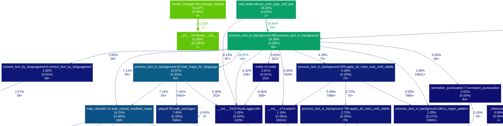
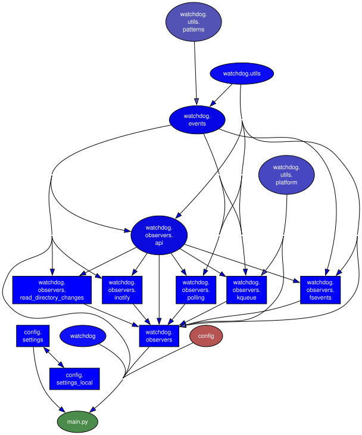

> ℹ️ *This is a machine-translated document. In case of discrepancies, refer to the [original document](../README.md).*


# ⬟ SL5 Aura – Deine Stimme. Ihre Regeln.

<!-- Stack Overflow & Community Badges -->
[](https://stackoverflow.com/users/2891692/sl5net)
[](https://python.org)
[](#)
[](#)
[](https://opensource.org/licenses/MIT)

> 100 % offline, datenschutzorientiertes Sprachassistenten-Framework.  
> Definieren Sie genau, was Ihre Stimme tut – mit einem einzigen Wort  
> bis hin zu vollständigen Python-Skripten. Keine Wolke. Keine Daten verlassen Ihren Computer.  
> Läuft im Terminal, Browser oder als Hintergrunddienst – unter Linux, macOS und Windows.

| 👵 Anfänger | 🎓 Lernender | 🧑‍💻 Entwickler |
|---|---|---|
| [grandma-mode](../docs/GettingStarted.i18n/GettingStarted-delang.md#the-oma-modus-beginner-shortcut) : schreibe einfach ein Wort, Aura erledigt den Rest | Lernen mit Koans — ein Konzept nach dem anderen | Vollständiges Python-Scripting, Plugins, API-Aufrufe |
| 🗄️ Zustandsverwaltung | Trino + Airflow-Orchestrierung, fzf, CopyQ, Sprach-/Terminalbefehle, Browser-UIs |

[](https://metrics.green-coding.io/ci.html?repo=sl5net/SL5-aura-service&branch=master&workflow=261851628)

⚡ **~2,87 J** pro Test (39 Tests ohne LanguageTool auf >800 Karten bei 0,07 s warm / 0,36 s kalt 🌿 gemessen mit [Eco-CI](https://metrics.green-coding.io/index.html)) · kein Cloud-Computing

[](https://metrics.green-coding.io/ci.html?repo=sl5net/SL5-aura-service&branch=master&workflow=350653175)

⚡ **Vollständige Testsuite:** 94 Tests mit LanguageTool auf über 800 Karten bei 0,07 Sekunden warm / 0,46 Sekunden kalt · kein Cloud-Computing

<details>
<summary>Schnellstart</summary>

## Schnellstart

### Option A: 1-Klick- und Web-Installer (empfohlen)

Einzeiliger Befehl oder eigenständiges Installationsprogramm für Linux, macOS und Windows:
- **[→ Installer Guide & Direct Downloads](../docs/OneClickInstaller.i18n/OneClickInstaller-delang.md)**

---

### Option B: Manuelle Installation (Entwickler / Git)

1. Laden Sie dieses Repository herunter oder klonen Sie es
2. Führen Sie das Setup-Skript für Ihr Betriebssystem aus (siehe Ordner `setup/`):
   - Linux (Arch/Manjaro): `bash setup/manjaro_arch_setup.sh`
   - Linux (Ubuntu/Debian): `bash setup/ubuntu_setup.sh`
   - Linux (openSUSE): `bash setup/suse_setup.sh`
   - Linux (NixOS): `nix-shell setup/shell.nix`, dann `bash setup/nixos_setup.sh`
   ===> ⚠️ Experimentell – von Autoren nicht getestet, Feedback willkommen!   
   - macOS: `bash setup/macos_setup.sh`
   - Windows: `setup/windows11_setup_with_ahk_copyq.bat`
3. Aura starten: `./scripts/restart_venv_and_run-server.sh`
4. Drücken Sie Ihren Hotkey und sprechen Sie – **[full guide →](../docs/GettingStarted.i18n/GettingStarted-delang.md)**

---

### Deinstallation
So entfernen Sie SL5 Aura-Hintergrunddienste, Autostart-Einträge und virtuelle Umgebungen:
- **Linux / macOS:** `bash setup/uninstall.sh`
- **Windows (PowerShell):** `powershell -File setup/uninstall.ps1`
*(Ihre benutzerdefinierten Regeln in `config/maps/` werden standardmäßig sicher aufbewahrt, es sei denn, Sie geben `--purge` an.*

---


**⚠️ Systemanforderungen und Kompatibilität**

*   **Windows:** ✅ Vollständig unterstützt (verwendet AutoHotkey/PowerShell).
*   **macOS:** ✅ Vollständig unterstützt (verwendet AppleScript).
*   **Linux (X11/Xorg):** ✅ Vollständig unterstützt.
*   **Linux (Wayland):** ✅ Vollständig unterstützt (getestet auf KDE Plasma 6 / Wayland).
*   **Linux (CachyOS / Arch-basiertes Rolling Release):** ✅ Vollständig unterstützt.
    Erfordert mimalloc (`sudo pacman -S mimalloc`) aufgrund der Glibc 2.43-Kompatibilität.
*   **Linux (NixOS):** 🧪 Experimentell – von der Community bereitgestelltes Setup, noch nicht getestet.
    Wenn Sie es versuchen, eröffnen Sie bitte eine Ausgabe oder PR mit Ihren Ergebnissen!    
*   **Linux (Manjaro):** Neu: Ein systemweiter Hotkey öffnet eine fzf-ähnliche, tastaturgesteuerte Oberfläche, sodass Sie Aura-Befehle von überall auf dem Desktop ausführen können (völlig entkoppelt vom aktiven Fenster). Dieser Hotkey-gesteuerte Launcher wird derzeit unter Linux (Manjaro) implementiert und getestet; Andere Distributionen funktionieren möglicherweise, erfordern jedoch das Setup. Siehe in 👉 [docs/Feature_Spotlight/CopyQ_Shortcut_Super_s.md](../docs/Feature_Spotlight/CopyQ_Shortcut_Super_s.i18n/CopyQ_Shortcut_Super_s-delang.md)    


    
SL5 Aura ist ein vollständiger **Offline-Sprachassistent**, der auf **Vosk** (für Speech-to-Text) und **LanguageTool** (für Grammatik/Stil) basiert und über einen optionalen **Local LLM (Ollama) Fallback** für kreative Antworten und erweitertes Fuzzy-Matching verfügt. Es wandelt Ihre Stimme in präzise Aktionen und Texte um und ist durch ein steckbares Regelsystem und eine dynamische Skript-Engine für die ultimative Anpassung konzipiert.
    
Übersetzungen: Dieses Dokument existiert auch in [other languages](https://github.com/sl5net/SL5-aura-service/tree/master/README.i18n).


Hinweis: Bei vielen Texten handelt es sich um maschinell erstellte Übersetzungen der englischen Originaldokumentation, die lediglich der allgemeinen Orientierung dienen. Im Falle von Unstimmigkeiten oder Unklarheiten ist stets die englische Version maßgebend. Wir freuen uns über die Hilfe der Community, um diese Übersetzung zu verbessern!

</details>

<details>
<summary>Demo</summary>

### 📺 Terminal-Demo

[](https://github.com/sl5net/SL5-aura-service/blob/master/data/demo_fast.gif)

> **Tipp:** Für eine bessere Terminalerfahrung siehe [Zsh Integration](../docs/linux/zsh-integration.i18n/zsh-integration-delang.md).

### 🎥 Video-Tutorial
[](https://www.youtube.com/watch?v=BZCHonTqwUw)

*(Alternativer Link: [skipvids.com](https://skipvids.com/?v=BZCHonTqwUw))*

</details>

<details>
<summary>Hauptmerkmale</summary>

## Hauptmerkmale

*   **Offline und privat:** 100 % lokal. Keine Daten verlassen jemals Ihren Computer.
*   **Dynamic Scripting Engine:** Gehen Sie über das Ersetzen von Text hinaus. Regeln können benutzerdefinierte Python-Skripte (`on_match_exec`) ausführen, um erweiterte Aktionen wie das Aufrufen von APIs (z. B. Wikipedia durchsuchen), die Interaktion mit Dateien (z. B. das Verwalten einer Aufgabenliste) oder das Generieren dynamischer Inhalte (z. B. eine kontextbezogene E-Mail-Begrüßung) durchzuführen.
*   **Kontextsensitive Regeln:** Regeln auf bestimmte Anwendungen beschränken. Mithilfe von `only_in_windows` können Sie sicherstellen, dass eine Regel nur dann ausgelöst wird, wenn ein bestimmter Fenstertitel (z. B. „Terminal“, „VS-Code“ oder „Browser“) aktiv ist. Dies funktioniert plattformübergreifend (Linux, Windows, macOS).
*  **High-Control Transformation Engine:** Implementiert eine konfigurationsgesteuerte, hochgradig anpassbare Verarbeitungspipeline. Regelpriorität, Befehlserkennung und Texttransformationen werden ausschließlich durch die Reihenfolge der Regeln in den Fuzzy Maps bestimmt und erfordern **Konfiguration, nicht Codierung**.
*   **Konservative RAM-Nutzung:** Verwaltet den Speicher intelligent und lädt Modelle nur dann vor, wenn genügend freier RAM verfügbar ist, um sicherzustellen, dass andere Anwendungen (wie Ihre PC-Spiele) immer Vorrang haben.
*   **Plattformübergreifend:** Funktioniert unter Linux, macOS und Windows.
*   **Vollautomatisch:** Verwaltet seinen eigenen LanguageTool-Server (Sie können aber auch einen externen verwenden).
*   **Blitzschnell:** Intelligentes Caching sorgt für sofortige „Listening…“-Benachrichtigungen und schnelle Verarbeitung.
*   **Dynamisches Zustandsmanagement über Trino:** Schnittstellenbewusste Konfigurations-Engine
    trennt die Einstellungen für `speech`, `terminal` und `web` – ändern Sie eine ohne
    die anderen beeinflussen. Enthält ein Echtzeit-Admin-Dashboard (Port 8084).
</details>

<details>
<summary>🔌 Gebrauchsfertige Integrationen</summary>
    
## 🔌 Gebrauchsfertige Integrationen

SL5-Aura verfügt über ein riesiges Ökosystem von über **100+ vorkonfigurierten Plugins**. Hier einige Highlights:

### OculiX / SikuliX IDE-Sprachsteuerung
SL5-Aura bietet erstklassige Sprachunterstützung für **OculiX** und **SikuliX IDE**. Diese Integration ermöglicht es Ihnen, Ihren Automatisierungscode zu „sprechen“.

*   **Voice-to-Snippet:** Sagen Sie „Klicken“, „Warten“ oder „Alle finden“, und der Dienst gibt sofort den richtigen Python-Code (z. B. `click("image.png")`) in die IDE ein.
*   **Window-Aware:** Das Plugin ist kontextsensitiv; Es wird nur aktiviert, wenn das OculiX/SikuliX-Fenster fokussiert ist.
*   **Intelligente Englischunterstützung:** Optimiert für `en-US` mit besonderem Fokus auf nicht-muttersprachliche Akzente (z. B. Deutsch-Englisch-Phonetik), um eine hohe Erkennungsgenauigkeit für die globale Community zu gewährleisten.
*   **Erweiterbar:** Verwendet das einfach zu bearbeitende `FUZZY_MAP_pre.py`-Format.

> **Status:** Vom OculiX-Team als Community-Plugin anerkannt (siehe [Issue #204](https://github.com/oculix-org/Oculix/issues/204)).

### LibreOffice IDE-Sprachsteuerung

### 0 A.D. Sprachsteuerung

---

</details>


<details>
<summary>Dokumentation</summary>

## Dokumentation

🔍 [Interactive Search (Algolia)](https://sl5net.github.io/SL5-aura-service/search_online.html?lang=de)

Für ein vollständiges technisches Nachschlagewerk, einschließlich aller Module und Skripte, besuchen Sie bitte unsere offizielle Dokumentationsseite. Sie wird automatisch erstellt und ist immer auf dem neuesten Stand.

[🇬🇧 English](https://sl5net.github.io/SL5-aura-service/README.html) | [🇸🇦 العربية](https://sl5net.github.io/SL5-aura-service/README.i18n/README-arlang.html) | [🇩🇪 Deutsch](https://sl5net.github.io/SL5-aura-service/README.i18n/README-delang.html) | [🇪🇸 Español](https://sl5net.github.io/SL5-aura-service/README.i18n/README-eslang.html) | [🇫🇷 Français](https://sl5net.github.io/SL5-aura-service/README.i18n/README-frlang.html) | [🇮🇳 हिन्दी](https://sl5net.github.io/SL5-aura-service/README.i18n/README-hilang.html) | [🇯🇵 日本語](https://sl5net.github.io/SL5-aura-service/README.i18n/README-jalang.html) | [🇰🇷 한국어](https://sl5net.github.io/SL5-aura-service/README.i18n/README-kolang.html) | [🇵🇱 Polski](https://sl5net.github.io/SL5-aura-service/README.i18n/README-pllang.html) | [🇵🇹 Português](https://sl5net.github.io/SL5-aura-service/README.i18n/README-ptlang.html) | [🇧🇷 Português Brasil](https://sl5net.github.io/SL5-aura-service/README.i18n/README-pt-BRlang.html) | [🇨🇳 简体中文](https://sl5net.github.io/SL5-aura-service/README.i18n/README-zh-CNlang.html)

### Funktions-Highlights
- [Interactive Rule Search & Run](../docs/Feature_Spotlight/Interactive_Rule_Search_and_Run.i18n/Interactive_Rule_Search_and_Run-delang.md) — Doppelfenster-`fzf`-Regelsuche, Live-Kontextvorschauen, sofortige Befehlsausführung über `Enter`/`Ctrl+R` und Editor-Integration über `Ctrl+E`. Unterstützt durch eine globale Tastenkombination (`Super+S`) und mehrere dedizierte Suchumgebungen, die über Sprachbefehle vorkonfiguriert sind.

### Build-Status

[](https://github.com/sl5net/SL5-aura-service/actions/workflows/manjaro_setup.yml)
[](https://github.com/sl5net/SL5-aura-service/actions/workflows/ubuntu_setup.yml)
[](https://github.com/sl5net/SL5-aura-service/actions/workflows/suse_setup.yml)

[](https://github.com/sl5net/SL5-aura-service/actions/workflows/macos_setup.yml)
[](https://github.com/sl5net/SL5-aura-service/actions/workflows/windows11_setup_bat.yml)

[](https://github.com/oculix-org/Oculix)
<div align="left">
<a href="https://github.com/sl5net/SL5-aura-service/stargazers">

</a>

<a href="https://sl5net.github.io/SL5-aura-service/">

</a>
</div>

</details>

👉 **Lesen Sie dies in anderen Sprachen:**

[🇬🇧 English](../README.md) | [🇸🇦 العربية](../README.i18n/README-arlang-delang.md) | [🇩🇪 Deutsch](../README.i18n/README-delang.md) | [🇪🇸 Español](../README.i18n/README-eslang-delang.md) | [🇫🇷 Français](../README.i18n/README-frlang-delang.md) | [🇮🇳 हिन्दी](../README.i18n/README-hilang-delang.md) | [🇯🇵 日本語](../README.i18n/README-jalang-delang.md) | [🇰🇷 한국어](../README.i18n/README-kolang-delang.md) | [🇵🇱 Polski](../README.i18n/README-pllang-delang.md) | [🇵🇹 Português](../README.i18n/README-ptlang-delang.md) | [🇧🇷 Português Brasil](../README.i18n/README-pt-BRlang-delang.md) | [🇨🇳 简体中文](../README.i18n/README-zh-CNlang-delang.md)

---

<details>
<summary>Installation</summary>

## Installation

### 🎥 Schnelle Installation ohne Moderation (Manjaro/Arch Video)
Sehen Sie sich den gesamten 6-minütigen Einrichtungsprozess an:
* **Download:** ~3 Minuten
* **Einrichtung und erster Start:** ~3 Minuten (einschließlich Willkommensassistent)

👉 **[SL5 Aura Installation Live-Demo on YouTube](https://www.youtube.com/watch?v=29xiwIW1ZHQ)**


Die Einrichtung ist ein zweistufiger Prozess:
1.  Laden Sie die neueste Version oder den neuesten Master herunter (https://github.com/sl5net/SL5-aura-service/archive/master.zip) oder klonen Sie dieses Repository auf Ihren Computer.
2.  Führen Sie das einmalige Setup-Skript für Ihr Betriebssystem aus.

Die Setup-Skripte kümmern sich um alles: Systemabhängigkeiten, Python-Umgebung und das Herunterladen der erforderlichen Modelle und Tools (~4 GB) direkt von unseren GitHub-Releases für maximale Geschwindigkeit.


#### Für Linux, macOS und Windows (mit optionaler Sprachexklusion)

Um Festplattenspeicher und Bandbreite zu sparen, können Sie während der Einrichtung bestimmte Sprachmodelle (`de`, `en`) oder alle optionalen Modelle (`all`) ausschließen. **Kernkomponenten (LanguageTool, lid.176) sind immer enthalten.**

Öffnen Sie ein Terminal im Stammverzeichnis des Projekts und führen Sie das Skript für Ihr System aus:

```bash
# For Ubuntu/Debian, Manjaro/Arch, macOS, or other derivatives
# (Note: Use bash or sh to execute the setup script)

bash setup/{your-os}_setup.sh [OPTION]

# For Arch-based systems (Manjaro, CachyOS, EndeavourOS, etc.):
`bash setup/manjaro_arch_setup.sh`

```sudo pacman -S mimalloc```


# Examples:
# Install everything (Default):
# bash setup/manjaro_arch_setup.sh

# Exclude German models:
# bash setup/manjaro_arch_setup.sh exclude=de

# Exclude all VOSK language models:
# bash setup/manjaro_arch_setup.sh exclude=all

# For Windows in an Admin-Powershell session

setup/windows11_setup.ps1 -Exclude [OPTION]

# Examples:
# Install everything (Default):
# setup/windows11_setup.ps1

# Exclude English models:
# setup/windows11_setup.ps1 -Exclude "en"

# Exclude German and English models:
# setup/windows11_setup.ps1 -Exclude "de,en"

# Or (recommend) - Run the BAT file: 
windows11_setup.bat -Exclude "en"
```

#### Für Windows
Führen Sie das Setup-Skript mit Administratorrechten aus.

**Installieren Sie ein Tool zum Lesen und Ausführen, z. B. [CopyQ](https://github.com/hluk/CopyQ) oder [AutoHotkey v2](https://www.autohotkey.com/)**. Dies ist für den Texteingabe-Watcher erforderlich.

Die Installation erfolgt vollständig automatisiert und dauert etwa **8–10 Minuten**, wenn 2 Modelle auf einem neuen System verwendet werden.

1. Navigieren Sie zum Ordner `setup`.
2. Doppelklicken Sie auf **`windows11_setup_with_ahk_copyq.bat`**.
   * *Das Skript fordert automatisch zur Eingabe von Administratorrechten auf.*
   * *Es installiert das Kernsystem, Sprachmodelle, **AutoHotkey v2** und **CopyQ**.*
3. Sobald die Installation abgeschlossen ist, wird **Aura Dictation** automatisch gestartet.

> **Hinweis:** Sie müssen Python oder Git nicht vorher installieren; Das Skript kümmert sich um alles.

---

#### Erweiterte / Benutzerdefinierte Installation
Wenn Sie die Client-Tools (AHK/CopyQ) nicht installieren möchten oder Speicherplatz sparen wollen, indem Sie bestimmte Sprachen ausschließen, können Sie das Kernskript über die Befehlszeile ausführen:

```powershell
# Core Setup only (No AHK, No CopyQ)
setup/windows11_setup_with_ahk_copyq.bat

# Exclude specific language models (saves space):
# Exclude English:
setup/windows11_setup_with_ahk_copyq.bat -Exclude "en"

# Exclude German and English:
setup/windows11_setup_with_ahk_copyq.bat -Exclude "de,en"
```

---
</details>


<details>
<summary>Verwendung</summary>

## Nutzung

### 1. Starte die Dienste

#### Unter Linux und macOS
Ein einziges Skript erledigt alles. Es startet den Haupt-Diktierdienst und den Datei-Watcher automatisch im Hintergrund.
```bash
# Run this from the project's root directory
./scripts/restart_venv_and_run-server.sh
```

#### Unter Windows
Das Starten des Dienstes ist ein **zweistufiger manueller Prozess**:

1.  **Starten Sie den Hauptdienst:** Führen Sie `start_aura.bat` aus. oder starten Sie den Dienst von `.venv` mit `python3`

### 2. Konfigurieren Sie Ihren Hotkey

Um das Diktat auszulösen, benötigen Sie einen globalen Hotkey, der eine bestimmte Datei erstellt. Wir empfehlen dringend das plattformübergreifende Tool [CopyQ](https://github.com/hluk/CopyQ).

#### Unsere Empfehlung: CopyQ

Erstellen Sie einen neuen Befehl in CopyQ mit einer globalen Tastenkombination.

**Befehl für Linux/macOS:**
```bash
touch /tmp/sl5_record.trigger
```

**Befehl für Windows bei Verwendung von [CopyQ](https://github.com/hluk/CopyQ):**
```js
copyq:
var filePath = 'c:/tmp/sl5_record.trigger';

var f = File(filePath);

if (f.openAppend()) {
    f.close();
} else {
    popup(
        'error',
        'cant read or open:\n' + filePath
        + '\n' + f.errorString()
    );
}
```


**Befehl für Windows bei Verwendung von [AutoHotkey](https://AutoHotkey.com):**
```sh
; trigger-hotkeys.ahk
; AutoHotkey v2 script
#SingleInstance Force ; Ensures only one instance of the script runs

;===================================================================
; Hotkey to trigger Aura
; Press Ctrl + Alt + T to write the trigger file.
;===================================================================
f9::
f10::
f11::
{
    local TriggerFile := "c:\tmp\sl5_record.trigger"
    FileAppend("t", TriggerFile)
    ToolTip("Aura Trigger activated!")
    SetTimer(() => ToolTip(), -1500)
}
```


### 3. Beginnen Sie mit dem Diktieren!
Klicken Sie in ein beliebiges Textfeld, drücken Sie Ihren Hotkey und die Benachrichtigung „Zuhören…“ wird angezeigt. Sprechen Sie deutlich und machen Sie dann eine Pause. Der korrigierte Text wird für Sie getippt.

</details>

---


<details>
<summary>Erweiterte Konfiguration (optional)</summary>

## Erweiterte Konfiguration (optional)

Sie können das Verhalten der Anwendung anpassen, indem Sie eine lokale Einstellungsdatei erstellen.

1.  Navigieren Sie zum Verzeichnis `config/`.
2.  Erstellen Sie eine Kopie von `config/settings_local.py_Example.txt` und benennen Sie sie in `config/settings_local.py` um.
3.  Bearbeiten Sie `config/settings_local.py` (es überschreibt alle Einstellungen aus der Hauptdatei `config/settings.py`).

Diese `config/settings_local.py`-Datei wird von Git standardmäßig ignoriert, sodass Ihre persönlichen Änderungen nicht durch Updates überschrieben werden.

### Plug-in-Struktur und Logik

Die Modularität des Systems ermöglicht eine robuste Erweiterung über das Plugins/-Verzeichnis.

Die Verarbeitungs-Engine hält sich strikt an eine **hierarchische Prioritätskette**:

1. **Ladereihenfolge der Module (hohe Priorität):** Regeln, die aus Kernsprachpaketen (de-DE, en-US) geladen werden, haben Vorrang vor Regeln, die aus dem Verzeichnis „plugins/“ geladen werden (die alphabetisch zuletzt geladen werden).
    
2. **Reihenfolge in der Datei (Mikropriorität):** Innerhalb einer bestimmten Kartendatei (FUZZY_MAP_pre.py) werden Regeln streng nach **Zeilennummer** (von oben nach unten) verarbeitet.
    

Diese Architektur stellt sicher, dass Kernsystemregeln geschützt sind, während projektspezifische oder kontextbezogene Regeln (wie die für CodeIgniter oder Spielsteuerungen) einfach über Plug-Ins als Erweiterungen mit niedriger Priorität hinzugefügt werden können.

</details>

<details>
<summary>Wichtige Skripte für Windows-Benutzer</summary>


## Wichtige Skripte für Windows-Benutzer

Hier ist eine Liste der wichtigsten Skripte, um die Anwendung auf einem Windows-System einzurichten, zu aktualisieren und auszuführen.

### Einrichtung und Aktualisierung

*   `chmod +x update.sh; ./update.sh`
*   `setup/setup.bat`: Das Hauptskript für die **erste einmalige Einrichtung** der Umgebung.
* [or](https://github.com/sl5net/SL5-aura-service/actions/runs/16548962826/job/46800935182) `Run powershell -Command "Set-ExecutionPolicy -ExecutionPolicy Bypass -Scope Process -Force; .\setup\windows11_setup.ps1"`

*   `update.bat`: Führen Sie dies aus dem Projektordner aus, um **den neuesten Code und die neuesten Abhängigkeiten abzurufen**.

### Die Anwendung ausführen
*   `start_aura.bat`: Ein primäres Skript, um **den Diktatdienst zu starten**.

### Kern- und Hilfsskripte
*   `aura_engine.py`: Der Kern-Python-Dienst (normalerweise von einem der oben genannten Skripte gestartet).
*   `get_suggestions.py`: Ein Hilfsskript für bestimmte Funktionalitäten.

</details>


## 🚀 Hauptfunktionen & Betriebssystemkompatibilität

<details>
<summary>Legende für die OS-Kompatibilität</summary>

Legende für die OS-Kompatibilität:  
*   🐧 **Linux** (z. B. Arch, Ubuntu)  
    *   🍏 **macOS**  
*   🪟 **Fenster**  
*   📱 **Android** (für mobile-spezifische Funktionen)  

---

</details>


### **Core Speech-to-Text (Aura) Engine
    Unsere primäre Engine für Offline-Spracherkennung und Audioverarbeitung.

    
<details>
<summary>Aura-Kern</summary>

**Aura-Core/** 🐧 🍏 🪟  
├─ `aura_engine.py` (Haupt-Python-Dienst orchestriert Aura) 🐧 🍏 🪟  
├┬ **Live Hot-Reload** (Konfiguration & Karten) 🐧 🍏 🪟  
│├ **Secure Private Map Loading (Integrity-First)** 🔒  🐧 🍏 🪟  
││ * **Workflow:** Laden Sie passwortgeschützte ZIP-Archive.   
│├ **Textverarbeitung & Korrektur/** Gruppiert nach Sprache (z. B. `de-DE`, `en-US`, ... )   
│├ 1. `normalize_punctuation.py` (Standardisiert die Interpunktion nach der Transkription) 🐧 🍏 🪟  
│├ 2. **Intelligente Vorkorrektur** (`FuzzyMap Pre` - [The Primary Command Layer](../docs/CreatingNewPluginModules.i18n/CreatingNewPluginModules-delang.md)) 🐧 🍏 🪟  
││ * **Dynamische Skriptausführung:** Regeln können benutzerdefinierte Python-Skripte (`on_match_exec`) auslösen, um erweiterte Aktionen wie API-Aufrufe, Datei-I/O oder dynamische Antworten auszuführen.  
││ * **Kaskadierende Ausführung:** Regeln werden sequentiell verarbeitet und ihre Auswirkungen sind **kumulativ **. Spätere Regeln gelten für Text, der durch frühere Regeln geändert wurde.  
││ * **Höchstes Prioritäts-Stop-Kriterium:** Wenn eine Regel ein **Full Match** (^...$) erreicht, stoppt die gesamte Verarbeitungspipeline für dieses Token sofort. Dieser Mechanismus ist entscheidend für die Implementierung zuverlässiger Sprachbefehle.  
│├ 3. `correct_text_by_languagetool.py` (Integriert LanguageTool für die Grammatik / Stilkorrektur) 🐧 🍏 🪟  
│├ **4. Hierarchische RegEx-Rule-Engine mit Ollama AI Fallback** 🐧 🍏 🪟  
││ * **Deterministische Steuerung:** Verwendet RegEx-Rule-Engine für präzise, hochpriorisierte Befehls- und Textsteuerung.  
│├ **Vector-Search Plugin** (Lazy Loading): Ermöglicht die semantische Suche durch die Verbindung lokaler Vector-Einbettungen mit der Fallback-Schicht Ollama/LLM 🐧  
││ * **Ollama AI (Local LLM) Fallback:** Dient als optionaler Check mit niedriger Priorität für **kreative Antworten, Q & A und erweitertes Fuzzy Matching **, wenn keine deterministische Regel erfüllt ist.  
││ * **Status:** Lokale LLM-Integration.
│└ 5. **Intelligente Nachkorrektur** (`FuzzyMap`)**– Nach-LT-Verfeinerung** 🐧 🍏 🪟  
││ * Wird nach LanguageTool angewendet, um LT-spezifische Ausgaben zu korrigieren. Befolgt die gleiche strenge kaskadierende Prioritätslogik wie die Vorkorrekturschicht.  
││ * **Dynamische Skriptausführung:** Regeln können benutzerdefinierte Python-Skripte ([on_match_exec](../docs/advanced-scripting.i18n/advanced-scripting-delang.md)) auslösen, um erweiterte Aktionen wie API-Aufrufe, Datei-I/O oder dynamische Antworten auszuführen.  
││ * **Fuzzy Fallback:** Der **Fuzzy Ähnlichkeits-Check** (gesteuert durch einen Schwellenwert, z.B. 85%) fungiert als Fehlerkorrekturschicht mit der niedrigsten Priorität. Es wird nur ausgeführt, wenn der gesamte vorhergehende deterministische / kaskadierende Regellauf keine Übereinstimmung gefunden hat (current rule matched ist False), wodurch die Leistung optimiert wird, indem nach Möglichkeit langsame Fuzzy-Checks vermieden werden.  
├┬ **Modellmanagement/**   
│├─ `prioritize_model.py` (Optimiert das Be-/Entladen des Modells basierend auf der Nutzung) 🐧 🍏 🪟  
│└─ `setup_initial_model.py` (Konfiguriert das erste Modell-Setup) 🐧 🍏 🪟  
├─ **Adaptiver VAD Timeout** 🐧 🍏 🪟  
├─ **Adaptiver Hotkey (Start/Stop)** 🐧 🍏 🪟  
├─ **Instant Language Switching** (Experimental via Model Preloading) 🐧 🍏         
├─ **Airflow Orchestration** (DAG-basierte Workflow-Automatisierung) 🐧 🍏 🪟
│   Benötigt Docker · UI: `http://localhost:8081` 🐧 🍏 🪟  
├─ **Trino State Engine** (interface-aware config per Speech/Terminal/Web) 🐧 🍏 🪟
└─  Erfordert Docker · Admin UI: `http://localhost:8084` 🐧 🍏 🪟  

**SystemUtilities/**   
├┬ **LanguageTool Server Management/**   
│├─ `start_languagetool_server.py` (Initialisiert den lokalen LanguageTool-Server) 🐧 🍏 🪟  
│└─ `stop_languagetool_server.py` (schaltet den LanguageTool-Server herunter) 🐧 🍏 
├─ `monitor_mic.sh` (z. B. zur Verwendung mit Headset ohne Tastatur und Monitor) 🐧 🍏 🪟  

### **Modell- & Paketverwaltung**  
    Werkzeuge für den robusten Umgang mit großen Sprachmodellen.  

**ModellVerwaltung/** 🐧 🍏 🪟  
├─ **Robuster Modell-Downloader** (GitHub Release-Chunks) 🐧 🍏 🪟  
├─ `split_and_hash.py` (Dienstprogramm für Repository-Besitzer, um große Dateien zu splitten und Prüfsummen zu erzeugen) 🐧 🍏 🪟  
└─ `download_all_packages.py` (Werkzeug für Endbenutzer zum Herunterladen, Überprüfen und Wiederzusammenfügen von mehrteiligen Dateien) 🐧 🍏 🪟  

</details>


<details>
<summary>Entwicklungs- und Bereitstellungshilfen</summary>

### **Entwicklungs- und Einsatzhelfer*  
    Skripte für die Einrichtung, das Testen und die Ausführung von Diensten in der Umgebung.  

*Tipp: Mit glogg können Sie mit regulären Ausdrücken nach interessanten Ereignissen in Ihren Protokolldateien suchen.*     
Bitte aktivieren Sie das Kontrollkästchen bei der Installation zur Verknüpfung mit Log-Dateien.    
https://glogg.bonnefon.org/     
    
*Tipp: Nachdem Sie Ihre Regex-Muster definiert haben, führen Sie `python3 tools/map_tagger.py` aus, um automatisch durchsuchbare Beispiele für die CLI-Tools zu generieren. Siehe [Map Maintenance Tools](../docs/Developer_Guide/Map_Maintenance_Tools.i18n/Map_Maintenance_Tools-delang.md) für Details.*

Dann vielleicht Doppelklick
`log/aura_engine.log`
    
**DevHelpers/**  
├┬ **Virtuelles Umweltmanagement/**  
│├ `scripts/restart_venv_and_run-server.sh` (Linux/macOS) 🐧 🍏  
│└ `scripts/restart_venv_and_run-server.ahk` (Windows) 🪟  
├┬ **Systemweite Diktat-Integration/**  
│├ Vosk-System-Listener-Integration 🐧 🍏 🪟  
│├ `scripts/monitor_mic.sh` (Linux-spezifische Mikrofonüberwachung) 🐧  
│└ `scripts/type_watcher.ahk` (AutoHotkey hört auf erkannten Text und tippt ihn systemweit ein) 🪟  
└─ **CI/CD Automation/**  
    └─ Erweiterte GitHub Workflows (Installation, Testen, Docs-Bereitstellung) 🐧 🍏 🪟 *(Läuft auf GitHub-Aktionen)*  

</details>

<details>
<summary>Experimentelle Merkmale</summary>
    
### **Bevorstehende / Experimentelle Features**  
    Features, die sich derzeit in der Entwicklung oder im Entwurfsstatus befinden.  

**ExperimentalFeatures/**  
├─ **ENTER AFTER DICTION REGEX** Beispiel-Aktivierungsregel "(BeispielAplicationThatNotExist | Pi, Ihre persönliche KI)" 🐧  
├┬Plugins  
│╰┬ **Live Lazy-Reload** (*) 🐧 🍏 🪟  
(*Änderungen an der Plugin-Aktivierung/-deaktivierung und deren Konfigurationen werden auf den nächsten Verarbeitungsablauf ohne Dienstneustart angewendet.*)  
│ ├ ** Git Commands** (Voice control for send git commands) 🐧 🍏 🪟  
│ ├ **wannweil** (Karte für Standort Deutschland-Wannweil) 🐧 🍏 🪟  
│ ├ **Poker Plugin (Entwurf)** (Stimmensteuerung für Poker-Anwendungen) 🐧 🍏 🪟  
│ └ **0 A.D. Plugin (Entwurf)** (Stimmensteuerung für 0 A.D. Spiel) 🐧   
├─ **Sound-Output beim Starten oder Beenden einer Session** (Beschreibung noch ausstehend) 🐧   
├─ **Sprachausgabe für Sehbehinderte** (Beschreibung noch ausstehend) 🐧 🍏 🪟  
└─ **SL5 Aura Android Prototype** (noch nicht vollständig offline) 📱  

---

*(Hinweis: Spezifische Linux-Distributionen wie Arch (ARL) oder Ubuntu (UBT) werden durch das allgemeine Linux-Symbol abgedeckt. Detaillierte Unterscheidungen können in Installationsanleitungen behandelt werden.)*
</details>

<details>
<summary>Klicken Sie, um den Befehl zu sehen, mit dem diese Skriptliste generiert wurde</summary>

```bash
{ find . -maxdepth 1 -type f \( -name "aura_engine.py" -o -name "get_suggestions.py" \) ; find . -path "./.venv" -prune -o -path "./.env" -prune -o -path "./backup" -prune -o -path "./LanguageTool-6.6" -prune -o -type f \( -name "*.bat" -o -name "*.ahk" -o -name "*.ps1" \) -print | grep -vE "make.bat|notification_watcher.ahk"; }
```
</details>

<details>
<summary>Eine grafische Übersicht über die Architektur</summary>

### Eine grafische Übersicht der Architektur:



      

</details>

<details>
<summary>Verwendete Modelle</summary>

## Verwendete Modelle:

Empfehlung: Verwenden Sie Modelle von Mirror https://github.com/sl5net/SL5-aura-service/releases/tag/v0.2.0.1 (wahrscheinlich schneller)

Diese gezippten Modelle müssen im Ordner `models/` gespeichert werden

`mv vosk-model-*.zip models/`


| Modell | Größe | Word Error Rate / Geschwindigkeit | Notizen | Lizenz |
| -------------------------------------------------------------------------------------- | ---- | --------------------------------------------------------------------------------------------- | ----------------------------------------- | ---------- |
| [vosk-model-en-us-0.22](https://alphacephei.com/vosk/models/vosk-model-en-us-0.22.zip) | 1.8G | 5.69 (librispeech test-clean)<br/>6.05 (tedlium)<br/>29.78 (Callcenter) | Genaues generisches US-Englisches Modell | Apache 2.0 |
| [vosk-model-de-0.21](https://alphacephei.com/vosk/models/vosk-model-de-0.21.zip) | 1.9G | 9.83 (Tuda-de-Test)<br/>24.00 (Podcast)<br/>12.82 (cv-Test)<br/>12.42 (mls)<br/>33.26 (mtedx) | Großes deutsches Modell für Telefonie und Server | Apache 2.0 |

Diese Tabelle bietet einen Überblick über verschiedene Vosk-Modelle, einschließlich ihrer Größe, Wortfehlerrate oder Geschwindigkeit, Anmerkungen und Lizenzinformationen.


- **Vosk-Modelle:** [Vosk-Model List](https://alphacephei.com/vosk/models)
- **LanguageTool:**  
   (6.6) [https://languagetool.org/download/](https://languagetool.org/download/) 

**Lizenz von LanguageTool:** [GNU Lesser General Public License (LGPL) v2.1 or later](https://www.gnu.org/licenses/old-licenses/lgpl-2.1.html)

---
</details>

## Unterstütze das Projekt
Wenn Sie dieses Tool nützlich finden, ziehen Sie bitte in Betracht, uns einen Kaffee zu spendieren! Ihre Unterstützung hilft, zukünftige Verbesserungen zu ermöglichen.

[](https://ko-fi.com/C0C445TF6)

[Stripe-Buy Now](https://buy.stripe.com/3cIdRa1cobPR66P1LP5kk00)

