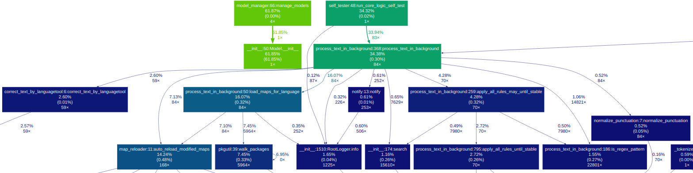
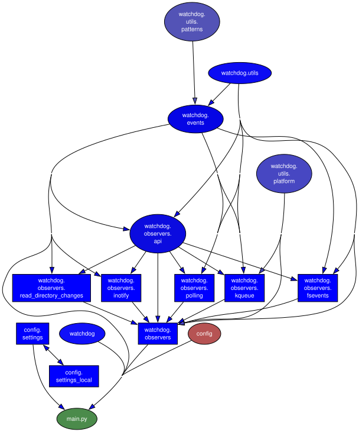

# ⬟ SL5 Aura – 你的声音。你的规则。

> 100%离线、隐私优先的语音助手框架。  
> 准确定义您的声音的作用 - 从一个单词  
> 完整的 Python 脚本。没有云。没有数据离开您的计算机。  
> 在 Linux、macOS 和 Windows 上的终端、浏览器或后台服务中运行。

| 👵 初学者 | 🎓 学习者 | 🧑u200d💻 开发者 |
|---|---|---|

| [grandma-mode](../docs/GettingStarted.i18n/GettingStarted-zh-CNlang.md#the-oma-modus-beginner-shortcut)：只需写一个字，剩下的由 Aura 完成 |与 Koans 一起学习 — 一次一个概念 |完整的 Python 脚本、插件、API 调用 |
| 🗄️ 状态管理 | Trino + Airflow 编排、fzf、CopyQ、语音/终端命令、浏览器 UI

⚡ **~2.87 J** 每次测试（在 >800 个地图上进行 39 次测试 @ 0.09 秒温暖/0.45 秒寒冷🌿 使用 [Eco-CI](https://metrics.green-coding.io/index.html) 测量） · 无云计算

<详情>

快速入门

## 快速入门
1.下载或克隆此存储库
2. 运行适用于您的操作系统的安装脚本（请参阅“setup/”文件夹）：
- Linux (Arch/Manjaro): `bash setup/manjaro_arch_setup.sh`
===> 🧩 阅读 [docs/LINUX_WAYLAND_dotool](../docs/LINUX_WAYLAND_dotool.i18n/LINUX_WAYLAND_dotool-zh-CNlang.md)
- Linux (Ubuntu/Debian): `bash setup/ubuntu_setup.sh`
- Linux (openSUSE): `bash setup/suse_setup.sh`
- Linux (NixOS)：`nix-shell setup/shell.nix` 然后 `bash setup/nixos_setup.sh`
===> ⚠️ 实验性的——未经作者测试，欢迎反馈！ X空格符X
- macOS：`bash setup/macos_setup.sh`
- Windows：`setup/windows11_setup_with_ahk_copyq.bat`
3.启动Aura：`./scripts/restart_venv_and_run-server.sh`
4. 按热键并说话 — **[full guide →](../docs/GettingStarted.i18n/GettingStarted-zh-CNlang.md)**

**⚠️系统要求和兼容性**

* **Windows：** ✅ 完全支持（使用 AutoHotkey/PowerShell）。
* **macOS：** ✅ 完全支持（使用 AppleScript）。
* **Linux (X11/Xorg)：** ✅ 完全支持。
* **Linux (Wayland)：** ✅ 完全支持（在 KDE Plasma 6 / Wayland 上测试）。
* **Linux（CachyOS / 基于 Arch 的滚动版本）：** ✅ 完全支持。
由于 glibc 2.43 兼容性，需要 mimalloc (`sudo pacman -S mimalloc`)。
* **Linux (NixOS)：** 🧪 实验性 — 社区贡献的设置，尚未测试。
如果您尝试一下，请用您的发现提出问题或 PR！  X空格符X
* **Linux (Manjaro)：** 新/实验性：系统范围的热键打开类似 fzf 的键盘驱动界面，以便您可以从桌面上的任何位置运行 Aura 命令（与活动窗口完全解耦）。这个热键驱动的启动器目前在 Linux (Manjaro) 上实现和测试；其他发行版可能也可以工作，但需要进行设置。参见👉 [docs/Feature_Spotlight/CopyQ_Shortcut_Super_s.md](../docs/Feature_Spotlight/CopyQ_Shortcut_Super_s.i18n/CopyQ_Shortcut_Super_s-zh-CNlang.md)   

X空格符X
SL5 Aura 是一款完整的**离线语音助手**，基于 **Vosk**（用于语音转文本）和 **LanguageTool**（用于语法/风格）构建，具有可选的**本地 LLM (Ollama) 后备**，用于创意响应和高级模糊匹配。它将您的声音转换为精确的操作和文本，旨在通过可插入的规则系统和动态脚本引擎实现最终定制。
X空格符X
翻译：该文档也存在于[other languages](https://github.com/sl5net/SL5-aura-service/tree/master/README.i18n)中。

注意：许多文本是原始英文文档的机器生成翻译，仅供一般指导。如有差异或歧义，始终以英文版本为准。我们欢迎社区帮助改进此翻译！

</详情>

<详情>
<摘要>演示</摘要>

### 📺 终端演示

> **提示：** 为了获得更好的终端体验，请参见[Zsh Integration](../docs/linux/zsh-integration.i18n/zsh-integration-zh-CNlang.md)。

### 🎥 视频教程

*（替代链接：[skipvids.com](https://skipvids.com/?v=BZCHonTqwUw)）*

</详情>

<详情>
<摘要>主要功能</摘要>

## 主要特点

* **离线和私人：** 100% 本地。任何数据都不会离开您的机器。
* **动态脚本引擎：** 超越文本替换。规则可以执行自定义 Python 脚本（`on_match_exec`）来执行高级操作，例如调用 API（例如，搜索维基百科）、与文件交互（例如，管理待办事项列表）或生成动态内容（例如，上下文感知的电子邮件问候语）。
* **上下文感知规则：** 将规则限制到特定应用程序。使用“only_in_windows”，您可以确保规则仅在特定窗口标题（例如“终端”、“VS Code”或“浏览器”）处于活动状态时触发。这适用于跨平台（Linux、Windows、macOS）。
* **高控制转换引擎：** 实现配置驱动、高度可定制的处理管道。规则优先级、命令检测和文本转换纯粹由模糊映射中规则的顺序决定，需要**配置，而不是编码**。
* **保守的 RAM 使用：** 智能管理内存，仅在有足够的可用 RAM 时才预加载模型，确保其他应用程序（例如您的 PC 游戏）始终具有优先权。
* **跨平台：** 适用于 Linux、macOS 和 Windows。
* **完全自动化：** 管理自己的 LanguageTool 服务器（但您也可以使用外部服务器）。
* **极快：** 智能缓存可确保即时“正在收听...”通知和快速处理。
* **通过 Trino 进行动态状态管理：** 接口感知配置引擎
分离 `speech`、`terminal` 和 `web` 的设置 — 更改一个而不需要
影响其他人。包括实时**管理仪表板**（端口 8084）。
</详情>

<详情>

 🔌 即用型集成

X空格符X
## 🔌 即用型集成

SL5-Aura 配备了一个庞大的生态系统，包含超过 **100 多个预配置插件**。以下是一些亮点：

### OculiX / SikuliX IDE 语音控制
SL5-Aura 为 **OculiX** 和 **SikuliX IDE** 提供一流的语音支持。这种集成允许您“说出”您的自动化代码。

* **语音到片段：** 说“单击”、“等待”或“查找全部”，服务会立即在 IDE 中键入正确的 Python 代码（例如，`click("image.png")`）。
* **Window-Aware：** 该插件是上下文相关的；它仅在 OculiX/SikuliX 窗口聚焦时激活。
* **智能英语支持：** 针对“en-US”进行了优化，特别关注非母语口音（例如德语-英语语音），确保全球社区的高识别准确性。
* **可扩展：** 使用易于编辑的“FUZZY_MAP_pre.py”格式。

> **状态：** 被 OculiX 团队认可为社区插件（请参阅 [Issue #204](https://github.com/oculix-org/Oculix/issues/204)）。

### LibreOffice IDE 语音控制

### 0 A.D. 语音控制

---

</详情>

<详情>
<摘要>文档</摘要>

## 文档

如需完整的技术参考，包括所有模块和脚本，请访问我们的官方文档页面。它是自动生成的并且始终是最新的。

👉 [**Go to Documentation sl5net.github.io/SL5-aura-service**](https://sl5net.github.io/SL5-aura-service/)

### 特色亮点
- [Interactive Rule Search & Run](../docs/Feature_Spotlight/Interactive_Rule_Search_and_Run.i18n/Interactive_Rule_Search_and_Run-zh-CNlang.md) — 双窗格“fzf”规则搜索、实时上下文预览、通过“Enter”/“Ctrl+R”即时命令执行以及通过“Ctrl+E”进行编辑器集成。由全局热键（“Super+S”）和通过语音命令预先配置的多个专用搜索环境支持。

### 构建状态

<div对齐=“左”>

</详情>

👉 **阅读其他语言版本：**

[🇬🇧 English](../README.md) | [🇸🇦 العربية](../README.i18n/README-arlang-zh-CNlang.md) | [🇩🇪 Deutsch](../README.i18n/README-delang-zh-CNlang.md) | [🇪🇸 Español](../README.i18n/README-eslang-zh-CNlang.md) | [🇫🇷 Français](../README.i18n/README-frlang-zh-CNlang.md) | [🇮🇳 हिन्दी](../README.i18n/README-hilang-zh-CNlang.md) | [🇯🇵 日本語](../README.i18n/README-jalang-zh-CNlang.md) | [🇰🇷 한국어](../README.i18n/README-kolang-zh-CNlang.md) | [🇵🇱 Polski](../README.i18n/README-pllang-zh-CNlang.md) | [🇵🇹 Português](../README.i18n/README-ptlang-zh-CNlang.md) | [🇧🇷 Português Brasil](../README.i18n/README-pt-BRlang-zh-CNlang.md) | [🇨🇳 简体中文](../README.i18n/README-zh-CNlang.md)

---

<详情>
<摘要>安装</摘要>

＃＃ 安装

### 🎥 无需审核即可快速安装（Manjaro/Arch 视频）
观看完整的 6 分钟设置过程：
* **下载：** ~3 分钟
* **设置和首次启动：** ~3 分钟（包括欢迎向导）

👉 **[SL5 Aura Installation Live-Demo on YouTube](https://www.youtube.com/watch?v=29xiwIW1ZHQ)**

设置过程分为两步：
1. 下载最新版本或主版本 ( https://github.com/sl5net/SL5-aura-service/archive/master.zip ) 或将此存储库克隆到您的计算机。
2. 运行适用于您的操作系统的一次性安装脚本。

设置脚本处理一切：系统依赖项、Python 环境，以及直接从我们的 GitHub 版本下载必要的模型和工具（~4GB）以获得最大速度。

#### 适用于 Linux、macOS 和 Windows（具有可选语言排除）

为了节省磁盘空间和带宽，您可以在安装过程中排除特定语言模型（“de”、“en”）或所有可选模型（“all”）。 **始终包含核心组件（LanguageTool、lid.176）。**

在项目根目录中打开终端并运行适用于您的系统的脚本：

__代码_块_0__

#### 对于 Windows
使用管理员权限运行安装脚本。

**安装读取和运行工具，例如[CopyQ](https://github.com/hluk/CopyQ)或[AutoHotkey v2](https://www.autohotkey.com/)**。这是文本输入观察者所必需的。

安装是完全自动化的，在新系统上使用 2 个型号时大约需要 **8-10 分钟**。

1. 导航至“setup”文件夹。
2. 双击 **`windows11_setup_with_ahk_copyq.bat`**。
* *脚本会自动提示管理员权限。*
* *它安装核心系统、语言模型、**AutoHotkey v2** 和 **CopyQ**。*
3. 安装完成后，**Aura Dictation** 将自动启动。

> **注意：** 您不需要预先安装Python或Git；脚本处理一切。

---

#### 高级/自定义安装
如果您不想安装客户端工具（AHK/CopyQ）或希望通过排除特定语言来节省磁盘空间，您可以通过命令行运行核心脚本：

__代码_块_1__

---
</详情>

<详情>
<摘要>用法</摘要>

＃＃ 用法

### 1.启动服务

#### 在 Linux 和 macOS 上
一个脚本可以处理所有事情。它会在后台自动启动主要听写服务和文件观察器。
__代码_块_2__

#### 在 Windows 上
启动服务是一个**两步手动过程**：

1. **启动主服务：** 运行`start_aura.bat`。或使用“python3”从“.venv”服务启动

### 2. 配置您的热键

要触发听写，您需要一个创建特定文件的全局热键。我们强烈推荐跨平台工具[CopyQ](https://github.com/hluk/CopyQ)。

#### 我们的推荐：CopyQ

使用全局快捷方式在 CopyQ 中创建新命令。

**Linux/macOS 命令：**
__代码_块_3__

**使用 [CopyQ](https://github.com/hluk/CopyQ) 时的 Windows 命令：**
__代码_块_4__

**使用 [AutoHotkey](https://AutoHotkey.com) 时的 Windows 命令：**
__代码_块_5__

### 3. 开始听写！
单击任何文本字段，按热键，将出现“正在收听...”通知。说清楚，然后停顿。系统将为您输入更正后的文本。

</详情>

---

<详情>

高级配置（可选）

## 高级配置（可选）

您可以通过创建本地设置文件来自定义应用程序的行为。

1. 导航到“config/”目录。
2. 创建 `config/settings_local.py_Example.txt` 的副本并将其重命名为 `config/settings_local.py`。
3. 编辑 `config/settings_local.py` （它会覆盖主 `config/settings.py` 文件中的任何设置）。

默认情况下，Git 会忽略此 config/settings_local.py 文件，因此您的个人更改不会被更新覆盖。

### 插件结构和逻辑

系统的模块化允许通过plugins/目录进行强大的扩展。

处理引擎严格遵守**分层优先级链**：

1. **模块加载顺序（高优先级）：** 从核心语言包（de-DE、en-US）加载的规则优先于从 plugins/ 目录（按字母顺序最后加载）加载的规则。
X空格符X
2. **文件内顺序（微优先级）：** 在任何给定的映射文件 (FUZZY_MAP_pre.py) 中，规则严格按 **行号** （从上到下）处理。
X空格符X

这种架构确保核心系统规则受到保护，而特定于项目或上下文感知的规则（例如 CodeIgniter 或游戏控件的规则）可以通过插件轻松添加为低优先级扩展。

</详情>

<详情>

Windows 用户的关键脚本

## Windows 用户的关键脚本

以下是在 Windows 系统上设置、更新和运行应用程序的最重要脚本的列表。

### 设置和更新

* `chmod +x update.sh; ./更新.sh`
* `setup/setup.bat`：环境的**初始一次性设置**的主脚本。
* [or](https://github.com/sl5net/SL5-aura-service/actions/runs/16548962826/job/46800935182) `运行 powershell -Command "Set-ExecutionPolicy -ExecutionPolicy Bypass -Scope Process -Force; .\setup\windows11_setup.ps1"`

* `update.bat` ：从项目文件夹运行它以**获取最新的代码和依赖项**。

### 运行应用程序
* `start_aura.bat`：**启动听写服务**的主要脚本。

### 核心和帮助脚本
* `aura_engine.py`：核心 Python 服务（通常由上述脚本之一启动）。
* `get_suggestions.py`：用于特定功能的帮助程序脚本。

</详情>

## 🚀 主要功能和操作系统兼容性

<详情>

操作系统兼容性图例

操作系统兼容性图例：  
* 🐧 **Linux**（例如 Arch、Ubuntu）  
* 🍏 **macOS**  
* 🪟 **Windows**  
* 📱 **Android**（针对移动设备特定功能）  

---

</详情>

### **核心语音转文本 (Aura) 引擎**
我们用于离线语音识别和音频处理的主要引擎。

X空格符X
<详情>

光环核心

__代码_块_6__
</详情>

<详情>

开发和部署助手

### **开发和部署助手**  
用于环境设置、测试和服务执行的脚本。  

*提示：glogg 使您能够使用正则表达式在日志文件中搜索有趣的事件。*   
安装时请选中该复选框以与日志文件关联。  X空格符X
https://translate.google.com/translate?hl=de&sl=en&tl=zh-CN&u=https://glogg.bonnefon.org/     
X空格符X
*提示：定义正则表达式模式后，运行“python3 tools/map_tagger.py”以自动生成 CLI 工具的可搜索示例。有关详细信息，请参阅 [Map Maintenance Tools](../docs/Developer_Guide/Map_Maintenance_Tools.i18n/Map_Maintenance_Tools-zh-CNlang.md)。*

然后也许双击
`日志/aura_engine.log`
X空格符X
**DevHelpers/**  
├┬ **虚拟环境管理/**  
│├ `scripts/restart_venv_and_run-server.sh` (Linux/macOS) 🐧 🍏  
│└ `scripts/restart_venv_and_run-server.ahk` (Windows) 🪟  
├┬ **全系统听写集成/**  
│├ Vosk-系统-监听器集成 🐧 🍏 🪟  
│├ `scripts/monitor_mic.sh` (Linux 专用麦克风监控) 🐧  
│└ `scripts/type_watcher.ahk` （AutoHotkey 监听已识别的文本并在系统范围内将其输入）🪟  
└─ **CI/CD 自动化/**  
└─ 扩展的 GitHub 工作流程（安装、测试、文档部署）🐧 🍏 🪟 *（在 GitHub 操作上运行）*  

</详情>

<详情>

实验特性

X空格符X
### **即将推出/实验性功能**  
目前正在开发或处于草稿状态的功能。  

**实验功能/**  
├─ **ENTER_AFTER_DICTATION_REGEX** 激活规则示例“(ExampleAplicationThatNotExist|Pi，您的个人 AI)” 🐧  
├┬插件  
│╰┬ **实时延迟重新加载** (*) 🐧 🍏 🪟  
（*对插件激活/停用及其配置的更改将应用于下一次处理运行，无需重新启动服务。*）  
│ ├ **git 命令**（发送 git 命令的语音控制）🐧 🍏 🪟  
│ ├ **万韦尔**（德国-万韦尔位置地图）🐧 🍏 🪟  
│ ├ **扑克插件（草案）**（扑克应用程序的语音控制）🐧 🍏 🪟  
│ └ **0 A.D. 插件（草稿）**（0 A.D. 游戏的语音控制）🐧   
├─ **开始或结束会话时的声音输出**（描述待定）🐧   
├─ **针对视障人士的语音输出**（描述待定）🐧 🍏 🪟  
└─ **SL5 Aura Android 原型**（尚未完全离线）📱  

---

*（注意：通用 Linux 🐧 符号涵盖了特定的 Linux 发行版，例如 Arch (ARL) 或 Ubuntu (UBT)。安装指南中可能会介绍详细的区别。）*
</详情>

<详情>

点击查看生成此脚本列表所使用的命令

__代码_块_7__
</详情>

<详情>

架构的图形概述

### 架构的图形概述：

X空格符X

</详情>

<详情>

使用过的型号

## 使用型号：

建议：使用 Mirror https://github.com/sl5net/SL5-aura-service/releases/tag/v0.2.0.1 中的模型（可能更快）

这些压缩的模型必须保存到“models/”文件夹中

`mv vosk-model-*.zip 模型/`

|型号|尺寸|字错误率/速度 |笔记|许可证|
| ------------------------------------------------------------------------------------------ | ---- | ---------------------------------------------------------------------------------------------------------- | ---------------------------------------------------- | ---------- |
| [vosk-model-en-us-0.22](https://alphacephei.com/vosk/models/vosk-model-en-us-0.22.zip) | 1.8G | 5.69（librispeech 测试清理） 6.05（tedlium） 29.78（呼叫中心）|精准通用美式英语模型|阿帕奇2.0 |
| [vosk-model-de-0.21](https://alphacephei.com/vosk/models/vosk-model-de-0.21.zip) | 1.9G| 9.83（Tuda-de 测试） 24.00（播客） 12.82（cv-测试） 12.42（mls） 33.26（mtedx）|德国大型电话和服务器模型|阿帕奇2.0 |

此表提供了不同 Vosk 型号的概述，包括其大小、字错误率或速度、注释和许可证信息。

- **Vosk 型号：** [Vosk-Model List](https://alphacephei.com/vosk/models)
- **语言工具：**  
(6.6)[https://languagetool.org/download/](https://languagetool.org/download/)

**LanguageTool许可证：** [GNU Lesser General Public License (LGPL) v2.1 or later](https://www.gnu.org/licenses/old-licenses/lgpl-2.1.html)

---
</详情>

## 支持该项目
如果您觉得这个工具有用，请考虑给我们买杯咖啡！您的支持有助于推动未来的改进。

[Stripe-Buy Now](https://buy.stripe.com/3cIdRa1cobPR66P1LP5kk00)