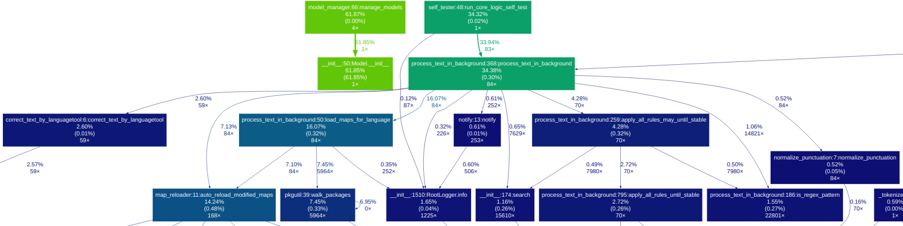
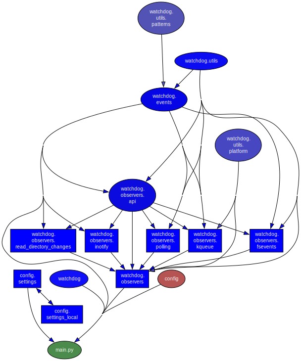

# System-Wide Offline Voice to Commands or Text, Pluggable System

**⚠️ System Requirements & Compatibility**

*   **Windows:** ✅ Fully supported (uses AutoHotkey/PowerShell).
*   **macOS:** ✅ Fully supported (uses AppleScript).
*   **Linux (X11/Xorg):** ✅ Fully supported. Recommended for best experience.
*   **Linux (Wayland):** ✅ Fully supported(in next relaise and in main-branch). 


Welcome to SL5 Aura Service! This document provides a quick overview of our key features and their operating system compatibility.

Aura isn't just a transcriber; it's a powerful, offline processing engine that transforms your voice into precise actions and text.

It's a complete, **offline voice assistant** built on **Vosk** (for Speech-to-Text) and **LanguageTool** (for Grammar/Style), now featuring an optional **Local LLM (Ollama) Fallback** for creative responses and advanced fuzzy matching. It is designed for ultimate customization through a pluggable rule system and a dynamic scripting engine.

    
Translations: This document also exists in [other languages](https://github.com/sl5net/SL5-aura-service/tree/master/docs).


Note: Many texts are machine-generated translations of the original English documentation and are intended for general guidance only. In case of discrepancies or ambiguities, the English version always prevails. We welcome help from the community to improve this translation!


[](https://www.youtube.com/watch?v=BZCHonTqwUw)
( https://www.youtube.com/watch?v=BZCHonTqwUw or https://skipvids.com/?v=BZCHonTqwUw )

## Key Features

*   **Offline & Private:** 100% local. No data ever leaves your machine.
*   **Dynamic Scripting Engine:** Go beyond text replacement. Rules can execute custom Python scripts (`on_match_exec`) to perform advanced actions like calling APIs (e.g., search Wikipedia), interacting with files (e.g., manage a to-do list), or generating dynamic content (e.g., a context-aware email greeting).
*  **High-Control Transformation Engine:** Implements a configuration-driven, highly customizable processing pipeline. Rule priority, command detection, and text transformations are determined purely by the sequential order of rules in the Fuzzy Maps, requiring **configuration, not coding**.
*   **Conservative RAM Usage:** Intelligently manages memory, preloading models only if enough free RAM is available, ensuring other applications (like your PC games) always have priority.
*   **Cross-Platform:** Works on Linux, macOS, and Windows.
*   **Fully Automated:** Manages its own LanguageTool server (but you can use a external also). 
*   **Blazing Fast:** Intelligent caching ensures instant "Listening..." notifications and fast processing.

## Documentation

For a complete technical reference, including all modules and scripts, please visit our official documentation page. It is automatically generated and always up-to-date.

[**Go to Documentation >>**](https://sl5net.github.io/SL5-aura-service/)


### Build Status
[](https://youtu.be/D9ylPBnP2aQ)
[](https://github.com/sl5net/SL5-aura-service/actions/workflows/ubuntu_setup.yml)
[](https://github.com/sl5net/SL5-aura-service/actions/workflows/suse_setup.yml)
[](https://github.com/sl5net/SL5-aura-service/actions/workflows/macos_setup.yml)
[](https://github.com/sl5net/SL5-aura-service/actions/workflows/windows11_setup_bat.yml)

[](https://sl5net.github.io/SL5-aura-service/)

**Read this in other languages:**

[🇬🇧 English](README.md) | [🇸🇦 العربية](docs/README/README-arlang.md) | [🇩🇪 Deutsch](docs/README/README-delang.md) | [🇪🇸 Español](docs/README/README-eslang.md) | [🇫🇷 Français](docs/README/README-frlang.md) | [🇮🇳 हिन्दी](docs/README/README-hilang.md) | [🇯🇵 日本語](docs/README/README-jalang.md) | [🇰🇷 한국어](docs/README/README-kolang.md) | [🇵🇱 Polski](docs/README/README-pllang.md) | [🇵🇹 Português](docs/README/README-ptlang.md) | [🇧🇷 Português Brasil](docs/README/README-pt-BRlang.md) | [🇨🇳 简体中文](docs/README/README-zh-CNlang.md)

---


## Installation

The setup is a two-step process:
1.  Download last Release or master ( https://github.com/sl5net/SL5-aura-service/archive/master.zip ) or clone this repository to your computer.
2.  Run the one-time setup script for your operating system.

The setup scripts handle everything: system dependencies, Python environment, and downloading the necessary models and tools (~4GB) directly from our GitHub Releases for maximum speed.


#### For Linux, macOS, and Windows (with Optional Language Exclusion)

To save disk space and bandwidth, you can exclude specific language models (`de`, `en`) or all optional models (`all`) during setup. **Core components (LanguageTool, lid.176) are always included.**

Open a terminal in the project's root directory and run the script for your system:

```bash
# For Ubuntu/Debian, Manjaro/Arch, macOS, or other derivatives
# (Note: Use bash or sh to execute the setup script)

bash setup/{your-os}_setup.sh [OPTION]

# Examples:
# Install everything (Default):
# bash setup/manjaro_arch_setup.sh

# Exclude German models:
# bash setup/manjaro_arch_setup.sh exclude=de

# Exclude all VOSK language models:
# bash setup/manjaro_arch_setup.sh exclude=all

# For Windows in an Admin-Powershell session

setup/windows11_setup.ps1 -Exclude [OPTION]

# Examples:
# Install everything (Default):
# setup/windows11_setup.ps1

# Exclude English models:
# setup/windows11_setup.ps1 -Exclude "en"

# Exclude German and English models:
# setup/windows11_setup.ps1 -Exclude "de,en"

# Or (recommend) - Start des BAT: 
windows11_setup.bat -Exclude "en"
```

#### For Windows
Run the setup script with administrator privileges.

**Install a tool for read and run e.g. [CopyQ](https://github.com/hluk/CopyQ) or [AutoHotkey v2](https://www.autohotkey.com/)**. This is required for the text-typing watcher.

The installation is fully automated and takes about **8-10 minutes** when using 2 Models on a fresh system.

1. Navigate to the `setup` folder.
2. Double-click on **`windows11_setup_with_ahk_copyq.bat`**.
   * *The script will automatically prompt for Administrator privileges.*
   * *It installs the Core System, Language Models, **AutoHotkey v2**, and **CopyQ**.*
3. Once the installation is complete, **Aura Dictation** will launch automatically.

> **Note:** You do not need to install Python or Git beforehand; the script handles everything.

---

#### Advanced / Custom Installation
If you prefer not to install the client tools (AHK/CopyQ) or want to save disk space by excluding specific languages, you can run the core script via the command line:

```powershell
# Core Setup only (No AHK, No CopyQ)
setup\windows11_setup.bat

# Exclude specific language models (saves space):
# Exclude English:
setup\windows11_setup.bat -Exclude "en"

# Exclude German and English:
setup\windows11_setup.bat -Exclude "de,en"
```


---

## Usage

### 1. Start the Services

#### On Linux & macOS
A single script handles everything. It starts the main dictation service and the file watcher automatically in the background.
```bash
# Run this from the project's root directory
./scripts/restart_venv_and_run-server.sh
```

#### On Windows
Starting the service is a **two-step manual process**:

1.  **Start the Main Service:** Run `start_aura.bat`. or start from `.venv` the service with `python3`

### 2. Configure Your Hotkey

To trigger dictation, you need a global hotkey that creates a specific file. We highly recommend the cross-platform tool [CopyQ](https://github.com/hluk/CopyQ).

#### Our Recommendation: CopyQ

Create a new command in CopyQ with a global shortcut.

**Command for Linux/macOS:**
```bash
touch /tmp/sl5_record.trigger
```

**Command for Windows when use [CopyQ](https://github.com/hluk/CopyQ):**
```js
copyq:
var filePath = 'c:/tmp/sl5_record.trigger';

var f = File(filePath);

if (f.openAppend()) {
    f.close();
} else {
    popup(
        'error',
        'cant read or open:\n' + filePath
        + '\n' + f.errorString()
    );
}
```


**Command for Windows when use [AutoHotkey](https://AutoHotkey.com):**
```sh
; trigger-hotkeys.ahk
; AutoHotkey v2 Skript
#SingleInstance Force ; Stellt sicher, dass nur eine Instanz des Skripts läuft

;===================================================================
; Hotkey zum Auslösen des Aura Triggers
; Drücke Strg + Alt + T, um die Trigger-Datei zu schreiben.
;===================================================================
f9::
f10::
f11::
{
    local TriggerFile := "c:\tmp\sl5_record.trigger"
    FileAppend("t", TriggerFile)
    ToolTip("Aura Trigger ausgelöst!")
    SetTimer(() => ToolTip(), -1500)
}
```


### 3. Start Dictating!
Click in any text field, press your hotkey, and a "Listening..." notification will appear. Speak clearly, then pause. The corrected text will be typed for you.

---


## Advanced Configuration (Optional)

You can customize the application's behavior by creating a local settings file.

1.  Navigate to the `config/` directory.
2.  Create a copy of `config/settings_local.py_Example.txt` and rename it to `config/settings_local.py`.
3.  Edit `config/settings_local.py` (it overrides any setting from the main `config/settings.py` file).

This `config/settings_local.py` file is (maybe) ignored by Git, so your personal changes (maybe) won't be overwritten by updates.

### Plug-in Structure and Logic

The system's modularity allows for robust extension via the plugins/ directory.

The processing engine strictly adheres to a **Hierarchical Priority Chain**:

1. **Module Loading Order (High Priority):** Rules loaded from core language packs (de-DE, en-US) take precedence over rules loaded from the plugins/ directory (which load last alphabetically).
    
2. **In-File Order (Micro Priority):** Within any given map file (FUZZY_MAP_pre.py), rules are processed strictly by **line number** (top-to-bottom).
    

This architecture ensures that core system rules are protected, while project-specific or context-aware rules (like those for CodeIgniter or game controls) can be easily added as low-priority extensions via plug-ins.
## Key Scripts for Windows Users

Here is a list of the most important scripts to set up, update, and run the application on a Windows system.

### Setup & Update
*   `setup/setup.bat`: The main script for the **initial one-time setup** of the environment.
* [or](https://github.com/sl5net/SL5-aura-service/actions/runs/16548962826/job/46800935182) `Run powershell -Command "Set-ExecutionPolicy -ExecutionPolicy Bypass -Scope Process -Force; .\setup\windows11_setup.ps1"`

*   `update.bat` : Rund these from Project folder **get the latest code and dependencies**.

### Running the Application
*   `start_aura.bat`: A primary script to **start the dictation service**.

### Core & Helper Scripts
*   `aura_engine.py`: The core Python service (usually started by one of the scripts above).
*   `get_suggestions.py`: A helper script for specific functionalities.


## 🚀 Key Features & OS Compatibility

Legend for OS Compatibility:  
*   🐧 **Linux** (e.g., Arch, Ubuntu)  
    *   🍏 **macOS**  
*   🪟 **Windows**  
*   📱 **Android** (for mobile-specific features)  

---

### **Core Speech-to-Text (Aura) Engine**
    Our primary engine for offline speech recognition and audio processing.

    
**Aura-Core/** 🐧 🍏 🪟  
├─ `aura_engine.py` (Main Python service orchestrating Aura) 🐧 🍏 🪟  
├┬ **Live Hot-Reload** (Config & Maps) 🐧 🍏 🪟  
│├ **Secure Private Map Loading (Integrity-First)** 🔒  🐧 🍏 🪟  
││ * **Workflow:** Loads password-protected ZIP archives.   
│├ **Text Processing & Correction/** Grouped by Language ( e.g. `de-DE`, `en-US`, ... )   
│├ 1. `normalize_punctuation.py` (Standardizes punctuation post-transcription) 🐧 🍏 🪟  
│├ 2. **Intelligent Pre-Correction** (`FuzzyMap Pre` - [The Primary Command Layer](docs/CreatingNewPluginModules.md)) 🐧 🍏 🪟  
││ * **Dynamic Script Execution:** Rules can trigger custom Python scripts (on_match_exec) to perform advanced actions like API calls, file I/O, or generate dynamic responses.  
││ * **Cascading Execution:** Rules are processed sequentially and their effects are **cumulative**. Later rules apply to text modified by earlier rules.  
││ * **Highest Priority Stop Criterion:** If a rule achieves a **Full Match** (^...$), the entire processing pipeline for that token stops immediately. This mechanism is critical for implementing reliable voice commands.  
│├ 3. `correct_text_by_languagetool.py` (Integrates LanguageTool for grammar/style correction) 🐧 🍏 🪟  
│├ **4. Hierarchical RegEx-Rule-Engine with Ollama AI Fallback** 🐧 🍏 🪟  
││ * **Deterministic Control:** Uses RegEx-Rule-Engine for precise, high-priority command and text control.  
││ * **Ollama AI (Local LLM) Fallback:** Serves as an optional, low-priority check for **creative answers, Q&A, and advanced Fuzzy Matching** when no deterministic rule is met.  
││ * **Status:** Local LLM integration.
│└ 5. **Intelligent Post-Correction** (`FuzzyMap`)**– Post-LT Refinement** 🐧 🍏 🪟
││ * Applied after LanguageTool to correct LT-specific outputs. Follows the same strict cascading priority logic as the Pre-Correction layer.  
││ * **Dynamic Script Execution:** Rules can trigger custom Python scripts ([on_match_exec](docs/advanced-scripting.md)) to perform advanced actions like API calls, file I/O, or generate dynamic responses.  
││ * **Fuzzy Fallback:** The **Fuzzy Similarity Check** (controlled by a threshold, e.g., 85%) acts as the lowest priority error-correction layer. It is only executed if the entire preceding deterministic/cascading rule run failed to find a match (current_rule_matched is False), optimizing performance by avoiding slow fuzzy checks whenever possible.  
├┬ **Model Management/**   
│├─ `prioritize_model.py` (Optimizes model loading/unloading based on usage) 🐧 🍏 🪟  
│└─ `setup_initial_model.py` (Configures the first-time model setup) 🐧 🍏 🪟  
├─ **Adaptive VAD Timeout** 🐧 🍏 🪟  
├─ **Adaptive Hotkey (Start/Stop)** 🐧 🍏 🪟  
└─ **Instant Language Switching** (Experimental via model preloading) 🐧 🍏   

**SystemUtilities/**   
├┬ **LanguageTool Server Management/**   
│├─ `start_languagetool_server.py` (Initializes the local LanguageTool server) 🐧 🍏 🪟  
│└─ `stop_languagetool_server.py` (Shuts down the LanguageTool server) 🐧 🍏 
├─ `monitor_mic.sh` (e.g. for use with Headset without use keyboard and Monitor) 🐧 🍏 🪟  

### **Model & Package Management**  
    Tools for robust handling of large language models.  

**ModelManagement/** 🐧 🍏 🪟  
├─ **Robust Model Downloader** (GitHub Release chunks) 🐧 🍏 🪟  
├─ `split_and_hash.py` (Utility for repo owners to split large files and generate checksums) 🐧 🍏 🪟  
└─ `download_all_packages.py` (Tool for end-users to download, verify, and reassemble multi-part files) 🐧 🍏 🪟  


### **Development & Deployment Helpers**  
    Scripts for environment setup, testing, and service execution.  

*Tip: glogg enables you to use regular expressions to search for interesting events in your log files.*     
Please check the checkbox when installing to associate with log-files.    
https://glogg.bonnefon.org/     
    
*Tip: After defining your regex patterns, run `python3 tools/map_tagger.py` to automatically generate searchable examples for the CLI tools. See [Map Maintenance Tools](docs/Developer_Guide/Map_Maintenance_Tools.md) for details.*

Then maybe Double Click 
`log/aura_engine.log`
    
    
**DevHelpers/**  
├┬ **Virtual Environment Management/**  
│├ `scripts/restart_venv_and_run-server.sh` (Linux/macOS) 🐧 🍏  
│└ `scripts/restart_venv_and_run-server.ahk` (Windows) 🪟  
├┬ **System-wide Dictation Integration/**  
│├ Vosk-System-Listener Integration 🐧 🍏 🪟  
│├ `scripts/monitor_mic.sh` (Linux-specific microphone monitoring) 🐧  
│└ `scripts/type_watcher.ahk` (AutoHotkey listens for recognized text and types it out system-wide) 🪟  
└─ **CI/CD Automation/**  
    └─ Expanded GitHub Workflows (Installation, testing, docs deployment) 🐧 🍏 🪟 *(Runs on GitHub Actions)*  

### **Upcoming / Experimental Features**  
    Features currently under development or in draft status.  

**ExperimentalFeatures/**  
├─ **ENTER_AFTER_DICTATION_REGEX** Example activation rule "(ExampleAplicationThatNotExist|Pi, your personal AI)" 🐧  
├┬Plugins  
│╰┬ **Live Lazy-Reload** (*) 🐧 🍏 🪟  
(*Changes to Plugin activation/deactivation, and their configurations, are applied on the next processing run without service restart.*)  
│ ├ **git commands** (Voice control for send git commands) 🐧 🍏 🪟  
│ ├ **wannweil** (Map for Location Germany-Wannweil) 🐧 🍏 🪟  
│ ├ **Poker Plugin (Draft)** (Voice control for poker applications) 🐧 🍏 🪟  
│ └ **0 A.D. Plugin (Draft)** (Voice control for 0 A.D. game) 🐧   
├─ **Sound Output when Start or End a Session** (Description pending) 🐧   
├─ **Speech Output for Visually Impaired** (Description pending) 🐧 🍏 🪟  
└─ **SL5 Aura Android Prototype** (Not fully offline yet) 📱  

---

*(Note: Specific Linux distributions like Arch (ARL) or Ubuntu (UBT) are covered by the general Linux 🐧 symbol. Detailed distinctions might be covered in installation guides.)*


<details>
<summary>Click to see the command used to generate this script list</summary>

```bash
{ find . -maxdepth 1 -type f \( -name "aura_engine.py" -o -name "get_suggestions.py" \) ; find . -path "./.venv" -prune -o -path "./.env" -prune -o -path "./backup" -prune -o -path "./LanguageTool-6.6" -prune -o -type f \( -name "*.bat" -o -name "*.ahk" -o -name "*.ps1" \) -print | grep -vE "make.bat|notification_watcher.ahk"; }
```
</details>


### bit grafically look to see whats behind:



      



# Used Models:

Recommendation: use models from Mirror https://github.com/sl5net/SL5-aura-service/releases/tag/v0.2.0.1 (probably faster)

This Ziped models must be saved into `models/` folder

`mv vosk-model-*.zip models/`


| Model                                                                                  | Size | Word error rate/Speed                                                                         | Notes                                     | License    |
| -------------------------------------------------------------------------------------- | ---- | --------------------------------------------------------------------------------------------- | ----------------------------------------- | ---------- |
| [vosk-model-en-us-0.22](https://alphacephei.com/vosk/models/vosk-model-en-us-0.22.zip) | 1.8G | 5.69 (librispeech test-clean)<br/>6.05 (tedlium)<br/>29.78 (callcenter)                       | Accurate generic US English model         | Apache 2.0 |
| [vosk-model-de-0.21](https://alphacephei.com/vosk/models/vosk-model-de-0.21.zip)       | 1.9G | 9.83 (Tuda-de test)<br/>24.00 (podcast)<br/>12.82 (cv-test)<br/>12.42 (mls)<br/>33.26 (mtedx) | Big German model for telephony and server | Apache 2.0 |

This table provides an overview of different Vosk models, including their size, word error rate or speed, notes, and license information.


- **Vosk-Models:** [Vosk-Model List](https://alphacephei.com/vosk/models)
- **LanguageTool:**  
   (6.6) [https://languagetool.org/download/](https://languagetool.org/download/) 

**License of LanguageTool:** [GNU Lesser General Public License (LGPL) v2.1 or later](https://www.gnu.org/licenses/old-licenses/lgpl-2.1.html)

---

## Support the Project
If you find this tool useful, please consider buying us a coffee! Your support helps fuel future improvements.

[](https://ko-fi.com/C0C445TF6)

[Stripe-Buy Now](https://buy.stripe.com/3cIdRa1cobPR66P1LP5kk00)


IgnorePkg = linux66-nvidia-575xx nvidia-575xx-utils lib32-nvidia-575xx-utils 

nvidia-575xx-settings mhwd-nvidia-575xx
