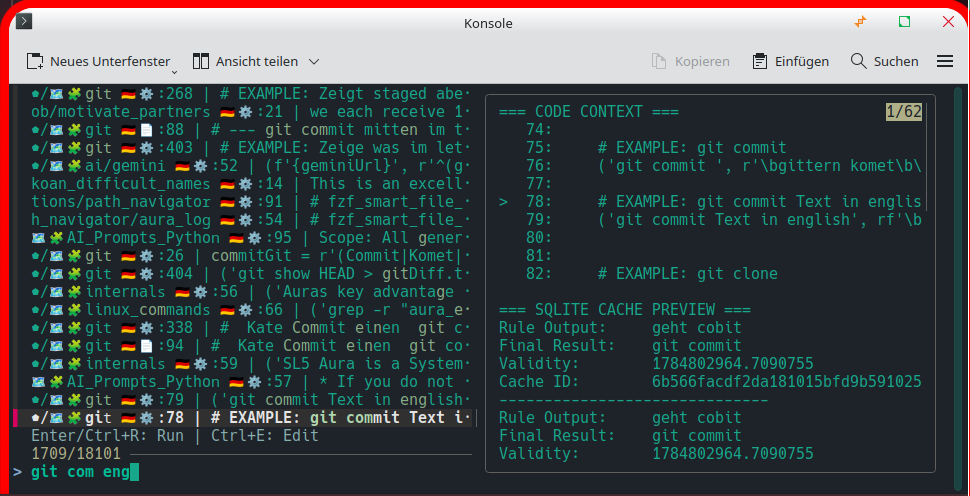
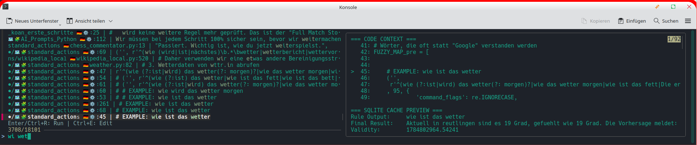
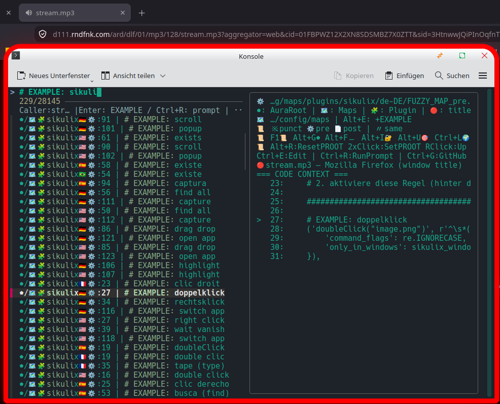

# Interaktywne wyszukiwanie i uruchamianie reguł

W centrum uwagi znajduje się interaktywny system wyszukiwania i wykonywania reguł, łączący polecenia głosowe, nawigację na żywo i natychmiastowe wykonanie.

## Podstawowe funkcje
[1] **Wyszukiwanie na żywo w dwóch panelach (`fzf`):** Lewe okienko filtruje pliki reguł; prawy panel wyświetla podgląd kontekstu liniowego poprzez `preview_rule.py`.
[2] **Natychmiastowe wykonanie (`Enter` / `Ctrl+R`):** Natychmiast uruchamia wyodrębnione polecenie docelowe poprzez `run_palette_command.py` w tle.
[3] **Edycja bezpośrednia (`Ctrl+E`):** Uruchamia edytor (CudaText z `@line`, Kate/VS Code z `--line`) bezpośrednio w docelowej linii.
[4] **Skrót klawiszowy pływającego okna:** powiązany z „Super+S” w celu zapewnienia szybkiego przepływu pracy w obszarze roboczym zintegrowanym z komputerem stacjonarnym.
[5] **Obsługa poleceń głosowych:** Liczne polecenia głosowe wstępnie konfigurują wzorce wyszukiwania w `search_rules.sh` w celu szybkiego i ukierunkowanego wyszukiwania.

## Obsługa wielu platform
- **Linux Bash (`run_rule.sh` / `search_rules.sh`):** W pełni funkcjonalna implementacja ze śledzeniem historii i operacjami schowka (`Ctrl+X` / `Ctrl+A`).
- **Windows PowerShell (`search_rules.ps1`):** Narzędzie towarzyszące zapewniające lekkie możliwości wyszukiwania terminali.

