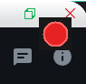
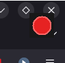

# Sobreposição de gravação (exibição na tela)

A sobreposição de gravação fornece um indicador visual imediato e multiplataforma do status do ditado. Ele opera independentemente dos daemons de notificação da área de trabalho e dos filtros "Não perturbe", exibindo o estado diretamente na tela principal.

## Exemplos visuais

| Inferior Esquerdo (`bl`) | Canto superior direito (`tr`) |
| :---: | :---: |
|  |  |
| *Combina com painéis escuros e bandejas do sistema* | *Alto contraste em janelas claras ou complexas* |

## Estados

- **Gravação (`🔴`)**: Um círculo vermelho vívido com um contorno destacado (`#e62222` em `#181818`) sinaliza a gravação de áudio ativa.
- **Parado**:
- `oculto` (padrão): A janela é completamente retirada, liberando espaço na área de trabalho para interação normal.
- `pentágono`: Exibe um emblema de pentágono geométrico sutil (`⬟`) durante o modo inativo.

## Configuração

As configurações são gerenciadas em `config/settings.py`:

```python
# Enable/disable on-screen overlay
RECORDING_OVERLAY_ENABLED = True

# Keep window always on top without borders
RECORDING_OVERLAY_TOPMOST = True

# Placement: "tr" (top-right) or "bl" (bottom-left)
RECORDING_OVERLAY_POSITION = "tr"

# Inactivity mode: "hidden" or "pentagon"
RECORDING_OVERLAY_IDLE_MODE = "hidden"

# Window dimension in pixels
RECORDING_OVERLAY_SIZE = 36
```

## Arquitetura

- Construído usando a biblioteca padrão Python (`tkinter`), exigindo zero dependências C externas.
- Executa em um thread daemon em segundo plano com manipulação de eventos de fila thread-safe.
- Detecta dinamicamente o monitor principal em ambientes com vários monitores.

(s, 10.9.'26 14:41 Qui)